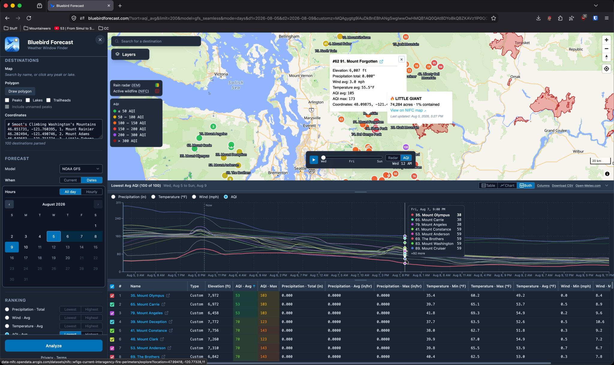

# Bluebird

> The Weather Window Finder

* [Summary](#summary)
* [How It Works](#how-it-works)
* [Quick Start](#quick-start)
* [Documentation](#documentation)
* [Support](#support)
* [License](#license)

<hr>

## Summary

It's Friday evening. Rain is moving in from the west, smoke is drifting from the east, and strong winds are building to the south. You want to get outside this weekend, but where should you go?

Bluebird helps you find out. Search for destinations, provide a list of coordinates, or draw a polygon and discover the best peaks, trails, lakes, and other destinations for your next adventure. Bluebird analyzes upcoming weather and ranks destinations by precipitation, wind, temperature, and air quality so you can quickly find the best objective.

Ready to find your Bluebird day? https://bluebirdforecast.com



<hr>

## How It Works

1. **Destinations**: Choose where to search by drawing an area on the map, searching by name, or providing custom coordinates.
2. **Forecast Window**: Analyze conditions right now, at a specific day and time, or across a multi-hour window.
3. **Result Ranking**: Choose how destinations should be ranked: driest conditions, lowest winds, ideal temperatures, or cleanest air.
4. **Options**: Apply constraints and enable additional features like wildfire visibility.
5. **Analyze**: Generate ranked results, explore them on the map, and compare forecast data across your selected destinations.
6. **Repeat**: Adjust your search area, forecast window, ranking, or options at any time to find a better window.

See [Usage](docs/USAGE.md) for the full walkthrough.

<hr>

## Quick Start

The whole app ships as a single Docker container. Clone it and bring it up:

```bash
git clone https://github.com/zimmertr/bluebird
cd bluebird
docker compose up --build -d
```

Then open `http://localhost:8000`. 

<hr>

## Documentation

| Doc | What it covers |
|---|---|
| [Usage](docs/USAGE.md) | Drawing polygons, forecast windows, and reading the results |
| [Limits](docs/LIMITS.md) | The four caps, why each exists, and what hitting one looks like |
| [Data Sources](docs/DATA.md) | What each source can tell you, and what it cannot |
| [API](docs/API.md) | The full HTTP API: no keys, no accounts, no authentication |
| [Configuration](docs/CONFIGURATION.md) | Environment variables and log levels |
| [Architecture](docs/ARCHITECTURE.md) | How it is built and how it deploys |
| [Development](docs/DEVELOPMENT.md) | Hot-reload setup and the test suites |
| [Traffic](docs/TRAFFIC.md) | Rate limiting and the budgets protecting the upstream APIs |
| [CI/CD](docs/CICD.md) | The pipeline from merge to production, with diagrams |

<hr>

## Support

Email **hello@bluebirdforecast.com** about anything: a summit at the wrong elevation, a destination that should be listed and isn't, a privacy question, or a page that will not load. No GitHub account needed.

If you can describe how to reproduce something, the [issue board](https://github.com/zimmertr/bluebird/issues) is the better channel. Security vulnerabilities go through [GitHub's private advisory form](https://github.com/zimmertr/bluebird/security/advisories/new) rather than a public issue, as described in [SECURITY.md](SECURITY.md).

Two public pages carry the rest: [privacy](https://bluebirdforecast.com/privacy) for what Bluebird does with your data and which providers your requests reach, and [terms](https://bluebirdforecast.com/terms) for the license, the warranty disclaimer, and the licenses covering the data.

<hr>

## License

Copyright (c) 2026 TJ Zimmerman. Bluebird is source-available: the code is public, but it is not open source software.

Bluebird is licensed under the [PolyForm Noncommercial License 1.0.0](LICENSE). You may use, modify, self-host, and share it for any noncommercial purpose. Commercial use of any kind requires a separate license: contact [hello@bluebirdforecast.com](mailto:hello@bluebirdforecast.com). It comes with no warranty; see [LICENSE](LICENSE) for the full terms.

The data providers and bundled software Bluebird is built on are credited in [NOTICES.md](NOTICES.md).
