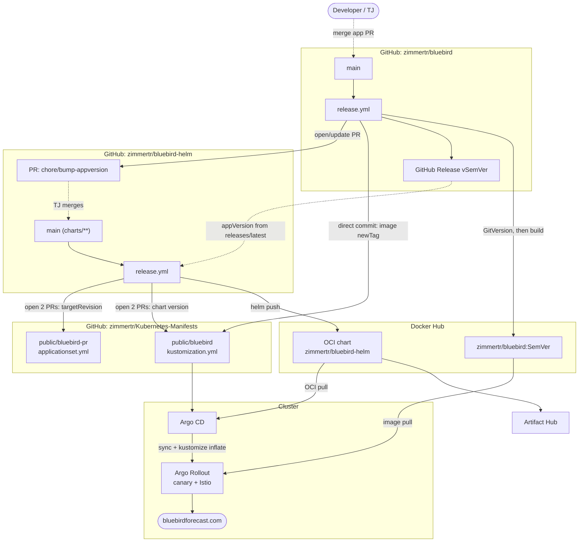
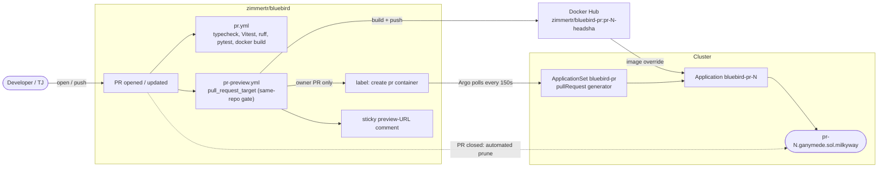
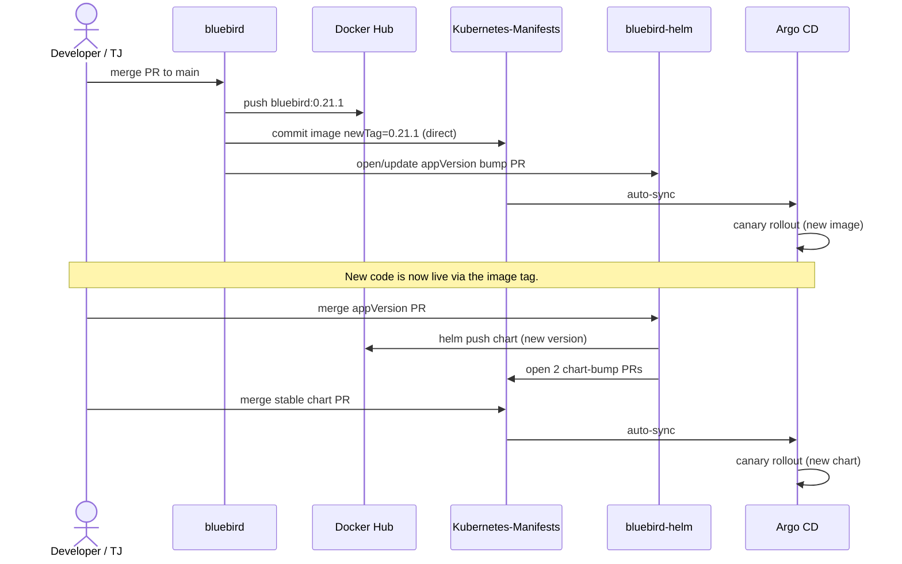

# CI/CD and Deployment Flow

How a change travels from a pull request to `bluebirdforecast.com`, across the
three repositories and the supporting services that automate the path.

> **Keep this current.** Any change that alters the flow — a workflow in
> `bluebird` or `bluebird-helm`, an image/chart/tag convention, or the
> `Kubernetes-Manifests` wiring — must update this document in the same change.
> The diagrams also describe two sibling repos, so changes made *there* should
> come back here too; nothing enforces that automatically.

## Systems

| System | Role |
| --- | --- |
| **`zimmertr/bluebird`** | Application monorepo (FastAPI backend + React SPA), built into a single Docker image. |
| **`zimmertr/bluebird-helm`** | Helm chart (`charts/bluebird`), published as an **OCI** artifact. |
| **`zimmertr/Kubernetes-Manifests`** | GitOps repo Argo CD watches. `public/bluebird/` is the stable app; `public/bluebird-pr/` is the per-PR preview `ApplicationSet`. |
| **Docker Hub** | `zimmertr/bluebird` (release images), `zimmertr/bluebird-pr` (preview images), and the OCI chart at `oci://registry-1.docker.io/zimmertr/bluebird-helm`. |
| **Artifact Hub** | Indexes the published OCI chart and security-scans its rendered **default image** (why the chart's `appVersion` must always name a real, published image tag). |
| **Cluster** | Argo CD (`argo-system`) syncing into `bluebird-system`; Argo Rollouts (canary + `AnalysisTemplate`), Istio `VirtualService`/`Gateway`, and cert-manager for `bluebirdforecast.com`. |

Everything consumes the chart **OCI-natively** (kustomize `helmCharts` and an
Argo CD `repoURL: oci://…`); nothing uses a classic Helm repo index.

## Release and promotion

Solid arrows are automated; dashed arrows are a human merging a PR.

**Path 1 — App release** (`bluebird/release.yml`, on merge to `main`, runs
concurrency-serialized):

1. **Determine Version** — GitVersion (Mainline, conventional commits) computes
   the SemVer. **Immutability guard:** if `docker manifest inspect
   zimmertr/bluebird:<semver>` already exists, every downstream job skips.
2. **Build & Push** — builds the image to Docker Hub `zimmertr/bluebird:<semver>`
   and pushes the `v<semver>` git tag.
3. **Create GitHub Release** — auto-generated notes.
4. **Update Kubernetes-Manifests** — a **direct commit** (no PR) sets
   `images.newTag: <semver>` in `public/bluebird/kustomization.yml`. Argo CD
   auto-syncs, so this is the fast path that rolls the new image to prod.
5. **Bump Helm Chart appVersion** — force-pushes a fixed `chore/bump-appversion`
   branch on `bluebird-helm` setting `Chart.yaml` `appVersion=<semver>`, and
   opens **or updates in place** a single PR (Dependabot-style dedup). Requires
   `GH_PAT` with contents + pull-requests write on `bluebird-helm`.

**Path 2 — Chart release** (`bluebird-helm/release.yml`, on merge to `main`
touching `charts/**`):

1. GitVersion computes the **chart** SemVer. **Immutability guard:** `helm show
   chart oci://…` — skip if that chart version was already published.
2. Resolves `appVersion` **at package time** from `bluebird`'s `releases/latest`
   (the value committed to `Chart.yaml` is only a local-render fallback — the
   resolver is the source of truth), then `helm package --version <chartver>
   --app-version <appver>` and `helm push` to the OCI repo; tags + GitHub release.
3. **bump-manifests** opens **two PRs** against `Kubernetes-Manifests`:
   - preview: `public/bluebird-pr/applicationset.yml` → `targetRevision: <chartver>`
   - stable: `public/bluebird/kustomization.yml` → `helmCharts[0].version: <chartver>`

   Kept as PRs (not direct commits) so a chart change reaching prod gets review.

**Path 3 — GitOps sync** (Argo CD → cluster): Argo CD reconciles
`public/bluebird/`. Kustomize inflates the OCI `helmCharts` entry with
`values.yml`, overlays the namespace / `AnalysisTemplate` / api-test ConfigMap,
and pins the image via `images.newTag`. The chart renders an **Argo Rollout**
(canary `33% → 66% → 100%` gated by the `AnalysisTemplate` api-test in prod)
plus the Istio `VirtualService`/`Gateway`; cert-manager terminates TLS.

### Two independent knobs reach prod

- **Image tag** — Path 1, a direct commit, fast and unreviewed.
- **Chart version** — Path 2 → Path 3, a reviewed PR.

A routine code change ships via the image tag alone; the chart version only
moves when the chart itself changes (or its default `appVersion` is bumped).

## PR preview environments

Every PR builds an image; **owner-authored** PRs additionally get a live,
per-PR preview environment.

- `pr-preview.yml` runs under **`pull_request_target`** (so it can reach the base
  repo's secrets to push images) behind a **hard same-repo gate** — fork PRs
  never execute with secrets. It builds `zimmertr/bluebird-pr:pr-<N>-<head_sha>`.
- For the owner's own PRs it applies the **`create pr container`** label and posts
  a sticky comment with the preview URL. Other authors (e.g. Dependabot) still
  build an image but get no label, so no preview pod spins up.
- Argo CD's `bluebird-pr` `ApplicationSet` uses a `pullRequest` generator that
  polls GitHub for the label every 150s and templates `bluebird-pr-<N>` from the
  OCI chart, overriding the image tag and injecting the `PREVIEW_BANNER` /
  `PREVIEW_PR` / `PREVIEW_COMMIT` env (surfaced by `/api/config` → the SPA
  banner). Closing the PR prunes the environment.

## A single change, end to end

## Conventions

- **GitVersion prefix → bump** (both repos): `feat!` / `BREAKING CHANGE:` →
  major; `feat:` → minor; `fix` / `perf` / `refactor` / `chore` / `docs` /
  `style` / `test` / `ci` → patch. The squash-merge commit message (the PR
  title) is what drives the release.
- **Immutability guards** in both release pipelines make merges idempotent: a
  re-run for an already-published image or chart version is a no-op.
