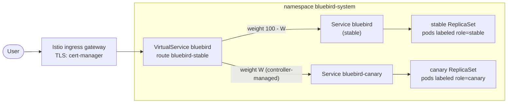
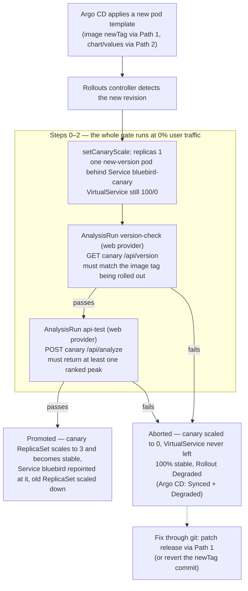
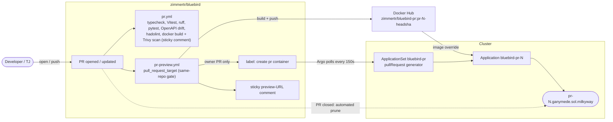
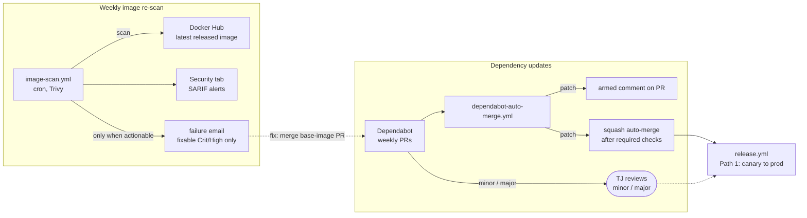
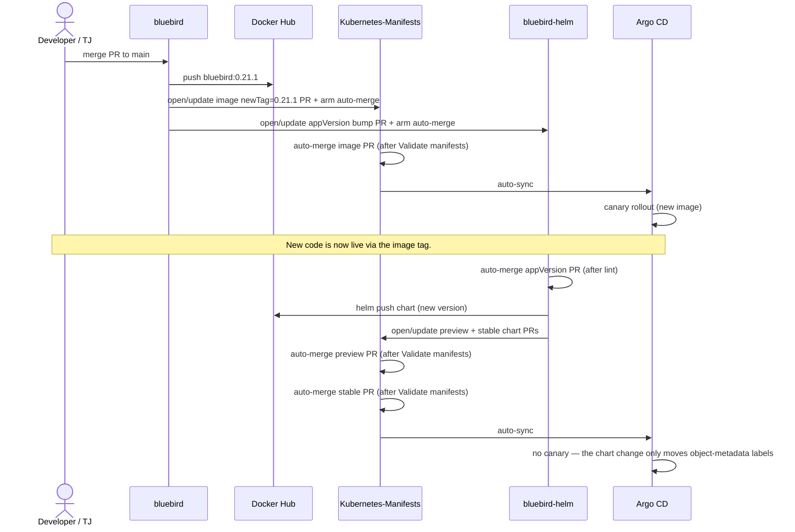

# CI/CD and Deployment Flow

How a change travels from a pull request to `bluebirdforecast.com`, across the
three repositories and the supporting services that automate the path.

> **Keep this current.** Any change that alters the flow — a workflow in
> `bluebird` or `bluebird-helm`, an image/chart/tag convention, or the
> `Kubernetes-Manifests` wiring — must update this document in the same change.
> The diagrams also describe two sibling repos, so changes made *there* should
> come back here too; nothing enforces that automatically.

## Systems

| System | Role |
| --- | --- |
| **`zimmertr/bluebird`** | Application monorepo (FastAPI backend + React SPA), built into a single Docker image. |
| **`zimmertr/bluebird-helm`** | Helm chart (`charts/bluebird`), published as an **OCI** artifact. |
| **`zimmertr/Kubernetes-Manifests`** | GitOps repo Argo CD watches. `public/bluebird/` is the stable app; `public/bluebird-pr/` is the per-PR preview `ApplicationSet`. `main` forbids direct commits; every write lands via a PR gated on the `Validate manifests` check. |
| **Docker Hub** | `zimmertr/bluebird` (release images), `zimmertr/bluebird-pr` (preview images), and the OCI chart at `oci://registry-1.docker.io/zimmertr/bluebird-helm`. |
| **Artifact Hub** | Indexes the published OCI chart and security-scans its rendered **default image** (why the chart's `appVersion` must always name a real, published image tag). |
| **Cluster** | Argo CD (`argo-system`) syncing into `bluebird-system`; Argo Rollouts (canary + `AnalysisTemplate`), Istio `VirtualService`/`Gateway`, and cert-manager for `bluebirdforecast.com`. |

Everything consumes the chart **OCI-natively** (kustomize `helmCharts` and an
Argo CD `repoURL: oci://…`); nothing uses a classic Helm repo index.

## Release and promotion

Solid arrows are automated; dashed arrows are a human action, or a read that
doesn't itself trigger the next step.


```mermaid
flowchart TD
    dev(["Developer / TJ"])

    subgraph BB["GitHub: zimmertr/bluebird"]
        bbMain["main"]
        bbRel["release.yml"]
        ghRelease["GitHub Release vSemVer"]
    end

    subgraph HELM["GitHub: zimmertr/bluebird-helm"]
        helmPR["PR: chore/bump-appversion<br/>(self-merging)"]
        helmMain["main (charts/**)"]
        helmRel["release.yml"]
    end

    subgraph KM["GitHub: zimmertr/Kubernetes-Manifests"]
        kmCheck["pr.yml — Validate manifests<br/>required check: YAML parse<br/>+ kustomize build of affected apps"]
        kmImagePR["PR: chore/bluebird-image<br/>(self-merging)"]
        kmStablePR["PR: chore/bluebird-stable-chart<br/>(self-merging)"]
        kmPreviewPR["PR: chore/bluebird-preview-chart<br/>(self-merging)"]
        kmStable["public/bluebird<br/>kustomization.yml"]
        kmPreview["public/bluebird-pr<br/>applicationset.yml"]
    end

    subgraph DH["Docker Hub"]
        dhImage["zimmertr/bluebird:SemVer"]
        dhChart["OCI chart<br/>zimmertr/bluebird-helm"]
    end

    ah["Artifact Hub"]

    subgraph CL["Cluster"]
        argocd["Argo CD"]
        rollout["Argo Rollout<br/>canary + Istio"]
        prod(["bluebirdforecast.com"])
    end

    dev -.->|merge app PR| bbMain
    bbMain --> bbRel
    bbRel -->|GitVersion, then build| dhImage
    bbRel --> ghRelease
    bbRel -->|open/update PR: image newTag| kmImagePR
    bbRel -->|open/update PR| helmPR

    helmPR -->|auto-merge once lint passes| helmMain
    helmMain --> helmRel
    ghRelease -.->|appVersion from releases/latest| helmRel
    helmRel -->|helm push| dhChart
    dhChart --> ah
    helmRel -->|open/update PR: chart version| kmStablePR
    helmRel -->|open/update PR: targetRevision| kmPreviewPR

    kmCheck -.->|gates| kmImagePR
    kmCheck -.->|gates| kmStablePR
    kmCheck -.->|gates| kmPreviewPR
    kmImagePR -->|auto-merge once green| kmStable
    kmStablePR -->|auto-merge once green| kmStable
    kmPreviewPR -->|auto-merge once green| kmPreview

    kmStable --> argocd
    dhChart -->|OCI pull| argocd
    argocd -->|sync + kustomize inflate| rollout
    dhImage -->|image pull| rollout
    rollout --> prod
```

**Path 1 — App release** (`bluebird/release.yml`, on merge to `main`, runs
concurrency-serialized):

1. **Determine Version** — GitVersion (Mainline, conventional commits) computes
   the SemVer. **Immutability guard:** if `docker manifest inspect
   zimmertr/bluebird:<semver>` already exists, every downstream job skips.
2. **Build & Push** — builds a **multi-arch manifest (`linux/amd64` +
   `linux/arm64`, arm64 via QEMU)** with SBOM + provenance attestations (the
   attestation manifests appear as "unknown/unknown" rows in Docker Hub's UI),
   pushes it to Docker Hub as `zimmertr/bluebird:<semver>`, and pushes the
   `v<semver>` git tag. Capped at `timeout-minutes: 30`: because releases
   serialize, a job hung on a registry timeout would otherwise dam every
   queued release for up to GitHub's 6-hour default.

   **Build identity.** Three build args are passed here and baked into the
   image as env vars: `APP_VERSION` (the GitVersion SemVer), `APP_COMMIT`
   (`github.sha`), and `APP_BUILT_AT` (stamped by a `date -u` step, because
   `github.event.repository.updated_at` is the last push rather than this
   build). They are what `GET /api/version` reports and what fills
   `info.version` in `/openapi.json`. `pr-preview.yml` passes the same three,
   with `APP_VERSION=pr-<number>`, so a preview environment can be verified the
   same way. Anything built without them (a local `docker build`, `docker
   compose up`) honestly reports `dev`.

   These args are declared at the very **end** of the Dockerfile, immediately
   before `USER`. `APP_BUILT_AT` changes on every build, so declaring them any
   earlier would invalidate the `pip install` layer every time and throw away
   the build cache.
3. **Create GitHub Release** — auto-generated notes.
4. **Update Kubernetes-Manifests** — a **self-merging PR** on the fixed
   `chore/bluebird-image` branch sets `images.newTag: <semver>` in
   `public/bluebird/kustomization.yml`. Once `Validate manifests` goes green it
   squash-merges itself, Argo CD auto-syncs, and the new image rolls to prod. No
   human step. See [Writes into Kubernetes-Manifests](#writes-into-kubernetes-manifests)
   for why every write is shaped this way.
5. **Bump Helm Chart appVersion** — force-pushes a fixed `chore/bump-appversion`
   branch on `bluebird-helm` setting `Chart.yaml` `appVersion=<semver>`, opens
   **or updates in place** a single PR (Dependabot-style dedup), then arms
   **squash auto-merge** so it lands itself once `Lint & render` passes. No human
   step. Requires `GH_PAT` with contents + pull-requests write on `bluebird-helm`,
   and `allow_auto_merge` enabled on that repo.

   Same shape as every write into `Kubernetes-Manifests`, for the same reasons:
   `bluebird-helm/main` requires both a PR *and* the `Lint & render` check, and
   auto-merge must be re-armed on the update path because GitHub disables it on
   any force-push to the head branch. See
   [Writes into Kubernetes-Manifests](#writes-into-kubernetes-manifests).

**Path 2 — Chart release** (`bluebird-helm/release.yml`, on merge to `main`
touching `charts/**`):

1. GitVersion computes the **chart** SemVer. **Immutability guard:** `helm show
   chart oci://…` — skip if that chart version was already published.
2. Resolves `appVersion` **at package time** from `bluebird`'s `releases/latest`
   (the value committed to `Chart.yaml` is only a local-render fallback — the
   resolver is the source of truth), then `helm package --version <chartver>
   --app-version <appver>` and `helm push` to the OCI repo; tags + GitHub release.
3. **bump-manifests** moves `Kubernetes-Manifests` onto the new chart via two
   PRs, one per consumer:
   - preview: `chore/bluebird-preview-chart` sets `targetRevision: <chartver>`
     in `public/bluebird-pr/applicationset.yml` (the ephemeral per-PR envs).
     Always **self-merging** — nothing it touches reaches prod.
   - stable: `chore/bluebird-stable-chart` sets `helmCharts[0].version:
     <chartver>` in `public/bluebird/kustomization.yml` (prod, triggers the
     canary rollout). Also **self-merging**; what keeps a chart change from
     quietly dropping a prod setting is the chart's own values schema, described
     in [Keeping prod's values honest](#keeping-prods-values-honest).

   They are separate branches rather than one PR touching both files so a
   preview bump is never blocked behind a prod change, and either can be closed
   independently. The chart release workflow is `concurrency`-serialized
   (`group: chart-release`): both branches are force-pushed, so two concurrent
   runs would clobber each other and leave the surviving PR pinned to whichever
   version pushed last.

   The fixed branch matters: version-suffixed branch names were the norm here
   until they stranded 6 open PRs across three chart releases while prod stayed
   pinned to an old chart. A new branch per version means `gh pr create` opens a
   new PR every time instead of advancing the existing one.

**Path 3 — GitOps sync** (Argo CD → cluster): Argo CD reconciles
`public/bluebird/`. Kustomize inflates the OCI `helmCharts` entry with
`values.yml`, overlays the namespace and the two `AnalysisTemplate`s, and pins
the image via `images.newTag`. The chart renders an **Argo Rollout** plus the
Istio `VirtualService`/`Gateway`; cert-manager terminates TLS. The rollout
itself is a three-step canary — one canary pod held at zero user traffic
through two blocking analyses, then promoted in a single cutover — described in
[Inside the prod canary](#inside-the-prod-canary-argo-rollouts) below.

### Two independent knobs reach prod

- **Image tag** — Path 1, a self-merging PR (`chore/bluebird-image`).
- **Chart version (stable)** — Path 2 → Path 3, a self-merging PR
  (`chore/bluebird-stable-chart`); prod, and the one that triggers a canary.
- **Chart version (preview)** — Path 2, a self-merging PR
  (`chore/bluebird-preview-chart`); ephemeral per-PR environments only, so it
  never touches prod.

A routine code change ships via the image tag alone; the chart version only
moves when the chart itself changes (or its default `appVersion` is bumped).
Review for a chart change happens in `bluebird-helm`, on the PR that writes the
change, where the diff is the actual edit rather than a version string — the
`Kubernetes-Manifests` bump is just the delivery of an already-reviewed chart.

### Writes into Kubernetes-Manifests

`Kubernetes-Manifests/main` **forbids direct commits**. All three automated
writes above go through a PR, and the thing they wait on is `pr.yml` /
**`Validate manifests`**, a required check in that repo which:

1. YAML-parses every changed `.yml`/`.yaml`. This is the failure mode the bump
   jobs can actually cause — they rewrite version lines with targeted `sed`, and
   a regex matching more than intended corrupts the file.
2. Renders every kustomization affected by the PR with `kustomize build
   --enable-helm` (nearest-ancestor mapping from changed files, skipping
   `deprecated/` and `*.disable*`). A chart version or image tag that doesn't
   resolve fails the PR instead of failing an Argo CD sync. Because
   `--enable-helm` shells out to `helm template`, this step is also where the
   chart's values schema is enforced — see [Keeping prod's values
   honest](#keeping-prods-values-honest).

Three constraints hold this together, and breaking any one of them silently
strands the automation:

- **Auto-merge needs something to wait on.** `gh pr merge --auto` is rejected on
  a PR with nothing blocking it (`Pull request is in clean status`). The
  required check is what makes the queue non-empty; without it, arming
  auto-merge errors out. Each job falls back to a plain `gh pr merge --squash`
  to cover the narrow window where the check already went green.
- **Auto-merge is re-armed on every release**, on the update path as well as
  the create path, because GitHub disables it on any force-push to the head
  branch — and every one of these jobs force-pushes its fixed branch each
  release. On a failing required check GitHub disarms auto-merge itself and
  notifies the arming account.
- **"Require branches to be up to date" must stay off** (`strict: false`). These
  branches are cut fresh off `main` and force-pushed; nothing ever rebases them,
  so requiring an up-to-date branch would deadlock whichever PR merged second.

The `GH_PAT` used for all of this needs contents + pull-requests write on
`Kubernetes-Manifests`, and `allow_auto_merge` must be on there. Concurrent
writes to the *same* file are safe: the image tag and the stable chart version
both live in `public/bluebird/kustomization.yml` but on lines far enough apart
that a three-way merge of the two branches never conflicts.

### Keeping prod's values honest

`public/bluebird/values.yml` pins prod's settings by *name*. Helm ignores a
value whose key the chart does not read, so if the chart renames or drops one,
that file keeps asserting a setting prod has already lost, and every render
still succeeds. That is the failure mode this hop has to catch, and nothing
about the version string in `kustomization.yml` reveals it.

The chart answers it at its own boundary: `charts/bluebird/values.schema.json`
sets `additionalProperties: false`, so an unrecognized key fails `helm template`
outright:

```
Error: values don't meet the specifications of the schema(s) in the following chart(s):
bluebird-helm:
- (root): Additional property revisionHistoryLimits is not allowed
```

`kustomize build --enable-helm` shells out to `helm template`, so the render
step above turns that into a red required check, on every PR and every branch,
not just the bot's. Argo CD renders the same way, so a values drift cannot reach
a sync either. `bluebird-helm`'s own PR workflow renders a deliberately unknown
key and **requires** the failure, so a schema that stops matching the templates
fails there instead of silently ceasing to guard anything.

The chart's README values table is therefore the complete set of keys, and a
chart PR that adds one adds it to the schema in the same change.

**What this replaced.** A render-diff step used to sit at the end of `Validate
manifests`, holding any `chore/bluebird-stable-chart` PR whose rendered prod
manifests moved. It asked the wrong question. An intended change to a chart
default — a raised memory request, a new probe — is *supposed* to move the
render, and `values.yml` pins almost nothing, so those changes tripped it while
the silent-drop case it was written for could still slip past as a plausible
diff. Worse, its only escape was the branch name: PR #494 was closed and #497
reopened the byte-identical one-line diff from a branch called `chartbump`. And
because the release branch is fixed and force-pushed, one held version blocked
every later one — prod sat eight chart versions behind while the bot kept
re-failing the same PR.

Routine chart releases are `appVersion`-only and change nothing in prod's
render: `bluebird.labels` — the only helper carrying
`app.kubernetes.io/version` — is applied to *object* metadata, while the
Rollout's pod template uses `bluebird.selectorLabels`, which omits it; and
`bluebird.image` does default to `.Chart.AppVersion`, but KM's `images:`
transformer pins an explicit `newTag` that wins. So merging such a bump triggers
no canary: the pod template is unchanged.

**When a chart change needs a matching `values.yml` edit**, make it in
`Kubernetes-Manifests` directly, in its own PR — the schema failure names the
key, and `enforce_admins` is on there, so the red required check blocks the bot
PR until it lands. Don't push the fix onto the bot branch; releases force-push
over it. The bot PR refreshes in place across releases, so once the values PR
merges it simply goes green on the next run.

Failure is safe by construction: an unrenderable chart, or one rejecting a value
this repo still pins, fails the render, which fails the required check, which
holds the PR. There is no classifier, no GitHub API call, and no state anywhere
— the verdict is the check, so GitHub's own machinery does the holding.

## Inside the prod canary (Argo Rollouts)

Every path above ends the same way: Argo CD applies a change to the Rollout's
**pod template** — the image tag (Path 1) or the chart/values (Path 2 → 3) —
and the Argo Rollouts controller takes over. This section is what "canary
rollout" means concretely in this cluster. There are **no `pause` steps and no
manual promotion**: a release either promotes itself to 100% or aborts itself
back to stable, which is what makes the unattended loops in the next section
safe — a Dependabot auto-merge faces exactly the same gates as a hand-cut
release.

The moving parts ("KM" = `Kubernetes-Manifests/public/bluebird/`):

| Resource | Comes from | Role |
| --- | --- | --- |
| `Rollout bluebird` | chart `workload.yaml`; strategy, steps, and history limits from KM `values.yml` | the workload — `useRollout: true` turns the chart's Deployment into a Rollout |
| `Service bluebird` / `bluebird-canary` | chart | stable/canary endpoints; the controller injects `rollouts-pod-template-hash` selectors so each always tracks the right ReplicaSet |
| `VirtualService bluebird` | chart | the weighted route `bluebird-stable`, whose two destination weights the controller owns |
| `AnalysisTemplate version-check` | KM `resources/analysisTemplate-versionCheck.yml` | identity gate — the canary must serve the exact image being rolled out |
| `AnalysisTemplate api-test` | KM `resources/analysisTemplate-apiTest.yml` | functional gate — a real `/api/analyze` through Overpass and Open-Meteo |

Both gates are Argo `web` providers, so the controller makes the calls itself:
a release starts no Job pods and mounts no scripts.

### The data plane

cert-manager terminates TLS at the Istio ingress gateway, which routes by the
`bluebird` VirtualService. Its named route `bluebird-stable` carries two
weighted destinations — the stable and canary Services — and the Rollouts
controller owns those weights while a release is in flight:


```mermaid
flowchart LR
    user(["User"])
    gw["Istio ingress gateway<br/>TLS: cert-manager"]

    subgraph NS["namespace bluebird-system"]
        vs["VirtualService bluebird<br/>route bluebird-stable"]
        ssvc["Service bluebird<br/>(stable)"]
        csvc["Service bluebird-canary"]
        srs["stable ReplicaSet<br/>pods labeled role=stable"]
        crs["canary ReplicaSet<br/>pods labeled role=canary"]
    end

    user --> gw --> vs
    vs -->|"weight 100 - W"| ssvc --> srs
    vs -->|"weight W (controller-managed)"| csvc --> crs
```

`trafficRouting.istio` in KM `values.yml` is what hands those weights to the
controller. It is not optional decoration: the `setCanaryScale` step below is
rejected without it, because absent a router Argo derives the canary's traffic
share from its replica count — the very dial `setCanaryScale` overrides. Prod
sat `Degraded` on exactly that once, when a comment-trimming commit deleted the
block and left the step behind.

### The three steps

Prod runs `replicas: 3`. The canary is pinned to a single pod for the whole
gate, so a release adds one pod rather than a second full set, and it adds it
without moving any user traffic onto it.


```mermaid
flowchart TD
    apply["Argo CD applies a new pod template<br/>(image newTag via Path 1, chart/values via Path 2)"]
    detect["Rollouts controller detects the new revision"]

    subgraph GATE["Steps 0–2 — the whole gate runs at 0% user traffic"]
        scale["setCanaryScale: replicas 1<br/>one new-version pod behind Service bluebird-canary<br/>VirtualService still 100/0"]
        vc["AnalysisRun version-check (web provider)<br/>GET canary /api/version<br/>must match the image tag being rolled out"]
        at["AnalysisRun api-test (web provider)<br/>POST canary /api/analyze<br/>must return at least one ranked peak"]
    end

    done["Promoted — canary ReplicaSet scales to 3 and becomes stable,<br/>Service bluebird repointed at it, old ReplicaSet scaled down"]
    abort["Aborted — canary scaled to 0, VirtualService never left<br/>100% stable, Rollout Degraded<br/>(Argo CD: Synced + Degraded)"]
    fix["Fix through git: patch release via Path 1<br/>(or revert the newTag commit)"]

    apply --> detect --> scale --> vc
    vc -->|"passes"| at
    at -->|"passes"| done
    vc -->|"fails"| abort
    at -->|"fails"| abort
    abort -.-> fix
```

**Step 0 — `setCanaryScale: {replicas: 1}`.** One pod of the *new* version comes
up behind `Service bluebird-canary`, whose hash selector the controller has
already repointed at the canary ReplicaSet. The VirtualService is untouched at
100/0, so ordinary users keep hitting stable for the entire gate. The step
completes only once that pod counts as Available, which means both analyses
below are guaranteed to run against a Ready pod and neither needs its own
startup grace.

**Step 1 — `version-check`, the identity gate.** A `web` provider GETs
`http://bluebird-canary.bluebird-system.svc.cluster.local:8000/api/version` and
reads `$.version`. The step passes the image being rolled out into the template
via `fieldRef` on `spec.template.spec.containers[0].image`, so the condition is
`hasSuffix("{{args.version}}", ":" + result)` — the canary must report the exact
release, not merely something semver-shaped. The `:` is load-bearing: it anchors
the comparison so a canary reporting `0.29.6` cannot satisfy an image tagged
`10.29.6` or `0.29.60`. `count: 1`, `failureLimit: 0` — nothing external is in
the path, so there is nothing legitimate to flake and nothing to retry.

**Step 2 — `api-test`, the functional gate.** Same provider, a single POST to
the canary's `/api/analyze` with a fixed body: a known-good polygon (Tiger
Mountain, Issaquah WA), `destination_type: peak`, `forecast_mode: current`,
`limit: 3`. One condition covers the whole chain — `len(result.results) >= 1` is
satisfiable only if Overpass discovered candidates, the ranking produced rows,
and Open-Meteo attached a forecast to them. `count: 1`, `failureLimit: 0`, 120 s
timeout. The flip side is deliberate: an extended Overpass or Open-Meteo outage
*blocks* releases rather than skipping validation, on the grounds that a release
which cannot serve a real analysis is not healthy whatever the reason.

Both gates hit the canary Service in-cluster rather than the public hostname,
which is why the controller needs no route back in through the gateway. The
cost is that ingress and TLS are no longer on the gate path; they are covered by
the stable traffic that never stopped flowing.

**Promotion.** There is no weighted soak: once step 2 passes, the step index
moves past the end of the list, which lifts the `setCanaryScale` pin. The canary
ReplicaSet scales to the full `replicas: 3`, *becomes* stable — the controller
repoints the `bluebird` Service's hash selector at it and returns the route to
100/0 against the new pods — and the old ReplicaSet scales down. The cutover is
therefore all-at-once after the gate rather than gradual. History is kept
deliberately short for Argo CD UI legibility by a single knob:
`revisionHistoryLimit: 1`, current plus one previous ReplicaSet. That one knob
bounds `AnalysisRun`s too, because a run whose ReplicaSet is gone is deleted
outright, so what survives is the gates of the last two releases. The
`successfulRunHistoryLimit` / `unsuccessfulRunHistoryLimit` counts are
deliberately **not** set: the controller's defaults sit above that cap and
never bind, and a count low enough to bind is a trap. Those counts are per
Rollout rather than per release, so anything below the number of analysis steps
deletes a gate's run the instant it passes — which is what a former
`successfulRunHistoryLimit: 1` did, leaving green releases looking like they
had only ever run one gate.

**Abort.** If either analysis fails — or someone runs `kubectl argo rollouts
abort` — the canary ReplicaSet scales to zero and the Rollout reports
**Degraded**. Nothing has to snap back: the stable ReplicaSet was never scaled
down and the VirtualService never left 100% stable, so no user request was ever
served by the version that failed.

### How this coexists with Argo CD

The `bluebird` Application is generated by the `public` ApplicationSet
(`Kubernetes-Manifests/public/applicationset.yml`) with automated sync, prune,
and **`selfHeal`** — which would instantly revert the controller's weight
edits mid-rollout. The ApplicationSet therefore carries an
`ignoreDifferences` jq rule matching exactly the destination weights on any
`*-stable` VirtualService route, so live weight drift is invisible to the
diff. Argo CD's health assessment understands Rollouts natively: the app shows
*Progressing* during a canary, *Healthy* at promotion, and *Degraded* after an
abort **while still being Synced** — an aborted rollout is Rollouts state, not
git drift, so `selfHeal` won't retry it. Remediation flows through git like
everything else: ship a fixed patch release via Path 1 (or revert the `newTag`
commit in `Kubernetes-Manifests`); the next pod-template change supersedes the
aborted revision and starts a fresh canary. `kubectl argo rollouts retry`
exists for one-off flakes, but the normal path is git.

## PR preview environments

Every PR builds an image; **owner-authored** PRs additionally get a live,
per-PR preview environment.


```mermaid
flowchart LR
    dev(["Developer / TJ"])

    subgraph BB["zimmertr/bluebird"]
        pr["PR opened / updated"]
        checks["pr.yml<br/>typecheck, Vitest, ruff, pytest, OpenAPI drift,<br/>hadolint, docker build + Trivy scan (sticky comment)"]
        preview["pr-preview.yml<br/>pull_request_target (same-repo gate)"]
        label["label: create pr container"]
        comment["sticky preview-URL comment"]
    end

    dhpr["Docker Hub<br/>zimmertr/bluebird-pr:pr-N-headsha"]

    subgraph CL["Cluster"]
        appset["ApplicationSet bluebird-pr<br/>pullRequest generator"]
        app["Application bluebird-pr-N"]
        env(["pr-N.ganymede.sol.milkyway"])
    end

    dev -->|open / push| pr
    pr --> checks
    pr --> preview
    preview -->|build + push| dhpr
    preview -->|owner PR only| label
    preview --> comment
    label -->|Argo polls every 150s| appset
    appset --> app
    dhpr -->|image override| app
    app --> env
    pr -.->|PR closed: automated prune| env
```

- `pr.yml`'s backend job runs `scripts/generate_openapi.py --check` after pytest.
  `backend/openapi.json` is committed so an API change lands as a reviewable diff
  instead of hiding inside Python, and this step fails the PR when the app and
  the snapshot disagree. Regenerate with `cd backend && python
  scripts/generate_openapi.py`. The script pins `APP_VERSION` to `dev` before
  importing the app, so `info.version` stays deterministic and a released build
  never reads as drift.
- `pr.yml`'s docker-build job loads the amd64 image into the runner and scans it
  with **Trivy** (`ignore-unfixed`: Debian/Alpine no-fix CVEs never gate). The
  report lands in the job step summary and as a **sticky PR comment** (matched by
  a hidden `<!-- bluebird-image-scan -->` marker, not `--edit-last`, so it can't
  clobber the preview-URL comment). The job fails only on **fixable
  Critical/High** findings. File-level exclusions live in **`trivy.yaml`** at the
  repo root, read by this job and by `image-scan.yml` below, so the gate that
  admits an image and the gate that re-checks it later cannot disagree. Each
  entry there carries its reasoning; today the only one is pip's vendored-source
  SBOM, which Trivy would otherwise read as installed inventory.
- `pr-preview.yml` runs under **`pull_request_target`** (so it can reach the base
  repo's secrets to push images) behind a **hard same-repo gate** — fork PRs
  never execute with secrets. It builds `zimmertr/bluebird-pr:pr-<N>-<head_sha>`.
- For the owner's own PRs it applies the **`create pr container`** label and posts
  a sticky comment with the preview URL. Other authors (e.g. Dependabot) still
  build an image but get no label, so no preview pod spins up.
- Argo CD's `bluebird-pr` `ApplicationSet` uses a `pullRequest` generator that
  polls GitHub for the label every 150s and templates `bluebird-pr-<N>` from the
  OCI chart, overriding the image tag and injecting the `PREVIEW_BANNER` /
  `PREVIEW_PR` / `PREVIEW_COMMIT` env (surfaced by `/api/config` → the SPA
  banner). Closing the PR prunes the environment.

## Unattended maintenance

Two loops keep shipped artifacts current with nobody initiating a change: a
weekly re-scan of the released image, and Dependabot dependency PRs with patch
auto-merge. Both funnel into Path 1, so the [prod
canary](#inside-the-prod-canary-argo-rollouts) still gates everything they
produce. The next two sections give the details.


```mermaid
flowchart LR
    subgraph SCAN["Weekly image re-scan"]
        cron["image-scan.yml<br/>cron, Trivy"]
        released["Docker Hub<br/>latest released image"]
        sarif["Security tab<br/>SARIF alerts"]
        email["failure email<br/>fixable Crit/High only"]
    end

    subgraph DEP["Dependency updates"]
        bot["Dependabot<br/>weekly PRs"]
        am["dependabot-auto-merge.yml"]
        note["armed comment on PR"]
        merge["squash auto-merge<br/>after required checks"]
        review(["TJ reviews<br/>minor / major"])
    end

    rel["release.yml<br/>Path 1: canary to prod"]

    cron -->|scan| released
    cron --> sarif
    cron -->|only when actionable| email
    email -.->|fix: merge base-image PR| bot

    bot --> am
    am -->|patch| note
    am -->|patch| merge
    bot -->|minor / major| review
    merge --> rel
    review -.-> rel
```

## Scheduled image scan

PR-time scanning gates what gets *published*, but CVEs are disclosed after
images ship. The released image rots while nothing rebuilds it.
`image-scan.yml` (weekly cron + `workflow_dispatch`) re-scans the **latest
released** `zimmertr/bluebird:<semver>` with Trivy:

- **Always:** SARIF upload → code-scanning alerts in the repo **Security tab**.
- **Gate:** the job fails — triggering GitHub's workflow-failure email — only
  when a **fixable Critical/High** vulnerability exists, i.e. only when there
  is something to do. Expected remediation: merge the open Dependabot
  base-image PR (below), which cuts a patch release on the fresh base and
  rolls it out through Path 1.

This job scans a published image rather than a checkout, so its `actions/checkout`
step exists purely to read `trivy.yaml`. That is deliberate: without the PR gate's
exclusions, an image could pass `pr.yml` and then fail here on findings that gate
had already ruled out.

Docker Hub's Scout insights cover the same registry-side rot but only update
the Hub dashboard; the cron's failure email is the push-based signal.

## Dependabot auto-merge

Dependabot opens weekly PRs (`pip` in `/backend`, `npm` in `/frontend`,
`github-actions` and `docker` base images in `/`). `dependabot-auto-merge.yml` enables **squash
auto-merge for patch (bugfix) bumps only** — GitHub completes the merge once
`main`'s required checks pass; **minor and major bumps wait for manual review**.
When it arms auto-merge it also posts a marker-guarded comment on the PR saying
so (and how to stop it), so the self-merge is visible from the PR page rather
than something to infer from the merge timeline.

In practice only `pip`/`npm` patches auto-merge: the GitHub Actions are
major-pinned (`@v7`), so Dependabot raises them as *major* bumps that wait for
review anyway. The Dockerfile's base tags float at the minor (`python:3.14-alpine`,
`node:26-alpine`), so docker-ecosystem PRs are minor/major runtime bumps that
also wait for review — base-OS *patch* fixes arrive without any PR, picked up
by whatever build happens next. The merge PAT is intentionally scoped to Contents + Pull requests
(not `Workflows`), so if an action is ever repinned to a full version, its patch
bumps stay manual by design rather than failing the merge.

The merge step runs with a PAT (`AUTO_MERGE_PAT`, stored as a **Dependabot**
secret — Actions secrets are empty in Dependabot-triggered runs), *not* the
default `GITHUB_TOKEN`. That's deliberate: a `GITHUB_TOKEN`-driven merge would be
suppressed by GitHub's recursion guard and never fire `release.yml`'s `on: push`,
so the patch would land on `main` but never ship. With the PAT, an auto-merged
patch deploys through Path 1 like any other merge — the prod canary still gates
the rollout.

The same trap applies to Path 1 step 5's auto-merged `appVersion` bump, which is
why that `gh pr merge` runs under `GH_PAT`: a `GITHUB_TOKEN`-driven merge there
would land the bump on `bluebird-helm/main` without ever firing Path 2, leaving
the chart unpublished.

## A single change, end to end


```mermaid
sequenceDiagram
    actor Dev as Developer / TJ
    participant BB as bluebird
    participant DH as Docker Hub
    participant KM as Kubernetes-Manifests
    participant HELM as bluebird-helm
    participant ARGO as Argo CD

    Dev->>BB: merge PR to main
    BB->>DH: push bluebird:0.21.1
    BB->>KM: open/update image newTag=0.21.1 PR + arm auto-merge
    BB->>HELM: open/update appVersion bump PR + arm auto-merge
    KM->>KM: auto-merge image PR (after Validate manifests)
    KM->>ARGO: auto-sync
    ARGO->>ARGO: canary rollout (new image)
    Note over Dev,ARGO: New code is now live via the image tag.
    HELM->>HELM: auto-merge appVersion PR (after lint)
    HELM->>DH: helm push chart (new version)
    HELM->>KM: open/update preview + stable chart PRs
    KM->>KM: auto-merge preview PR (after Validate manifests)
    KM->>KM: auto-merge stable PR (after Validate manifests)
    KM->>ARGO: auto-sync
    ARGO->>ARGO: no canary — the chart change only moves object-metadata labels
```

An `appVersion`-only chart release lands with no canary because the pod template
never changes. A chart release that *does* change prod's render — a new default,
a new resource — lands the same way and rolls out as a canary; it was reviewed
in `bluebird-helm`, and `Validate manifests` still has to render it against
prod's `values.yml`. See [Keeping prod's values
honest](#keeping-prods-values-honest).

## Conventions

- **GitVersion prefix → bump** (both repos): `feat!` / `BREAKING CHANGE:` →
  major; `feat:` → minor; `fix` / `perf` / `refactor` / `chore` / `docs` /
  `style` / `test` / `ci` → patch. The squash-merge commit message (the PR
  title) is what drives the release.
- **Immutability guards** in both release pipelines make merges idempotent: a
  re-run for an already-published image or chart version is a no-op.
