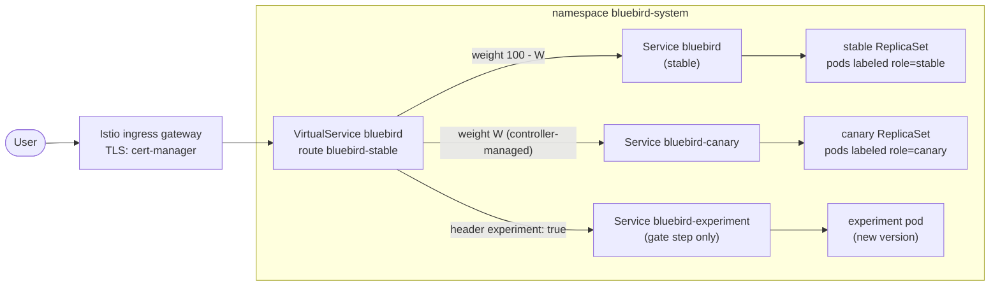
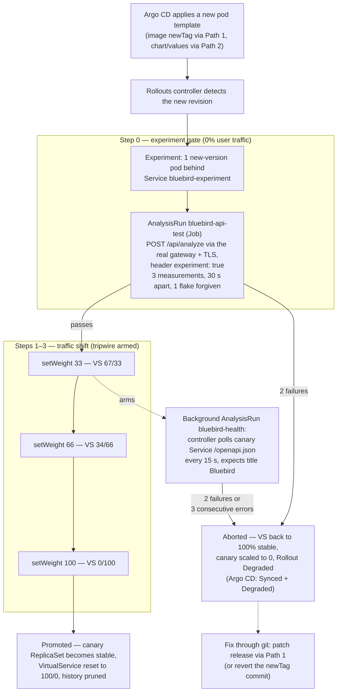
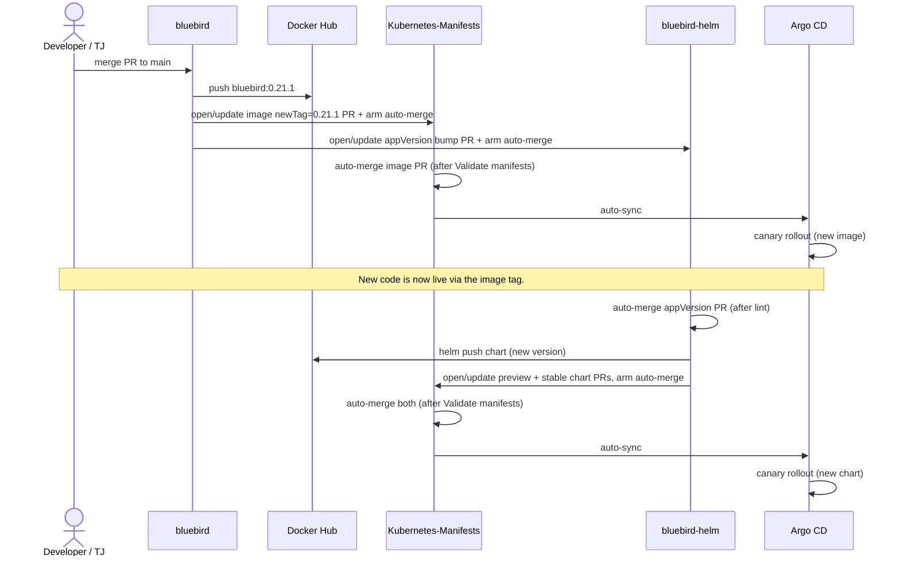

# CI/CD and Deployment Flow

How a change travels from a pull request to `bluebirdforecast.com`, across the
three repositories and the supporting services that automate the path.

> **Keep this current.** Any change that alters the flow — a workflow in
> `bluebird` or `bluebird-helm`, an image/chart/tag convention, or the
> `Kubernetes-Manifests` wiring — must update this document in the same change.
> The diagrams also describe two sibling repos, so changes made *there* should
> come back here too; nothing enforces that automatically.

## Systems

| System | Role |
| --- | --- |
| **`zimmertr/bluebird`** | Application monorepo (FastAPI backend + React SPA), built into a single Docker image. |
| **`zimmertr/bluebird-helm`** | Helm chart (`charts/bluebird`), published as an **OCI** artifact. |
| **`zimmertr/Kubernetes-Manifests`** | GitOps repo Argo CD watches. `public/bluebird/` is the stable app; `public/bluebird-pr/` is the per-PR preview `ApplicationSet`. `main` forbids direct commits; every write lands via a PR gated on the `Validate manifests` check. |
| **Docker Hub** | `zimmertr/bluebird` (release images), `zimmertr/bluebird-pr` (preview images), and the OCI chart at `oci://registry-1.docker.io/zimmertr/bluebird-helm`. |
| **Artifact Hub** | Indexes the published OCI chart and security-scans its rendered **default image** (why the chart's `appVersion` must always name a real, published image tag). |
| **Cluster** | Argo CD (`argo-system`) syncing into `bluebird-system`; Argo Rollouts (canary + `AnalysisTemplate`), Istio `VirtualService`/`Gateway`, and cert-manager for `bluebirdforecast.com`. |

Everything consumes the chart **OCI-natively** (kustomize `helmCharts` and an
Argo CD `repoURL: oci://…`); nothing uses a classic Helm repo index.

## Release and promotion

Solid arrows are automated; dashed arrows are a human action, or a read that
doesn't itself trigger the next step.

```mermaid
flowchart TD
    dev(["Developer / TJ"])

    subgraph BB["GitHub: zimmertr/bluebird"]
        bbMain["main"]
        bbRel["release.yml"]
        ghRelease["GitHub Release vSemVer"]
    end

    subgraph HELM["GitHub: zimmertr/bluebird-helm"]
        helmPR["PR: chore/bump-appversion<br/>(self-merging)"]
        helmMain["main (charts/**)"]
        helmRel["release.yml"]
    end

    subgraph KM["GitHub: zimmertr/Kubernetes-Manifests"]
        kmCheck["pr.yml — Validate manifests<br/>required check: YAML parse<br/>+ kustomize build of affected apps"]
        kmImagePR["PR: chore/bluebird-image<br/>(self-merging)"]
        kmStablePR["PR: chore/bluebird-stable-chart<br/>(self-merging)"]
        kmPreviewPR["PR: chore/bluebird-preview-chart<br/>(self-merging)"]
        kmStable["public/bluebird<br/>kustomization.yml"]
        kmPreview["public/bluebird-pr<br/>applicationset.yml"]
    end

    subgraph DH["Docker Hub"]
        dhImage["zimmertr/bluebird:SemVer"]
        dhChart["OCI chart<br/>zimmertr/bluebird-helm"]
    end

    ah["Artifact Hub"]

    subgraph CL["Cluster"]
        argocd["Argo CD"]
        rollout["Argo Rollout<br/>canary + Istio"]
        prod(["bluebirdforecast.com"])
    end

    dev -.->|merge app PR| bbMain
    bbMain --> bbRel
    bbRel -->|GitVersion, then build| dhImage
    bbRel --> ghRelease
    bbRel -->|open/update PR: image newTag| kmImagePR
    bbRel -->|open/update PR| helmPR

    helmPR -->|auto-merge once lint passes| helmMain
    helmMain --> helmRel
    ghRelease -.->|appVersion from releases/latest| helmRel
    helmRel -->|helm push| dhChart
    dhChart --> ah
    helmRel -->|open/update PR: chart version| kmStablePR
    helmRel -->|open/update PR: targetRevision| kmPreviewPR

    kmCheck -.->|gates| kmImagePR
    kmCheck -.->|gates| kmStablePR
    kmCheck -.->|gates| kmPreviewPR
    kmImagePR -->|auto-merge once green| kmStable
    kmStablePR -->|auto-merge once green| kmStable
    kmPreviewPR -->|auto-merge once green| kmPreview

    kmStable --> argocd
    dhChart -->|OCI pull| argocd
    argocd -->|sync + kustomize inflate| rollout
    dhImage -->|image pull| rollout
    rollout --> prod
```

**Path 1 — App release** (`bluebird/release.yml`, on merge to `main`, runs
concurrency-serialized):

1. **Determine Version** — GitVersion (Mainline, conventional commits) computes
   the SemVer. **Immutability guard:** if `docker manifest inspect
   zimmertr/bluebird:<semver>` already exists, every downstream job skips.
2. **Build & Push** — builds a **multi-arch manifest (`linux/amd64` +
   `linux/arm64`, arm64 via QEMU)** with SBOM + provenance attestations (the
   attestation manifests appear as "unknown/unknown" rows in Docker Hub's UI),
   pushes it to Docker Hub as `zimmertr/bluebird:<semver>`, and pushes the
   `v<semver>` git tag. Capped at `timeout-minutes: 30`: because releases
   serialize, a job hung on a registry timeout would otherwise dam every
   queued release for up to GitHub's 6-hour default.
3. **Create GitHub Release** — auto-generated notes.
4. **Update Kubernetes-Manifests** — a **self-merging PR** on the fixed
   `chore/bluebird-image` branch sets `images.newTag: <semver>` in
   `public/bluebird/kustomization.yml`. Once `Validate manifests` goes green it
   squash-merges itself, Argo CD auto-syncs, and the new image rolls to prod. No
   human step. See [Writes into Kubernetes-Manifests](#writes-into-kubernetes-manifests)
   for why every write is shaped this way.
5. **Bump Helm Chart appVersion** — force-pushes a fixed `chore/bump-appversion`
   branch on `bluebird-helm` setting `Chart.yaml` `appVersion=<semver>`, opens
   **or updates in place** a single PR (Dependabot-style dedup), then arms
   **squash auto-merge** so it lands itself once `Lint & render` passes. No human
   step. Requires `GH_PAT` with contents + pull-requests write on `bluebird-helm`,
   and `allow_auto_merge` enabled on that repo.

   Same shape as every write into `Kubernetes-Manifests`, for the same reasons:
   `bluebird-helm/main` requires both a PR *and* the `Lint & render` check, and
   auto-merge must be re-armed on the update path because GitHub disables it on
   any force-push to the head branch. See
   [Writes into Kubernetes-Manifests](#writes-into-kubernetes-manifests).

**Path 2 — Chart release** (`bluebird-helm/release.yml`, on merge to `main`
touching `charts/**`):

1. GitVersion computes the **chart** SemVer. **Immutability guard:** `helm show
   chart oci://…` — skip if that chart version was already published.
2. Resolves `appVersion` **at package time** from `bluebird`'s `releases/latest`
   (the value committed to `Chart.yaml` is only a local-render fallback — the
   resolver is the source of truth), then `helm package --version <chartver>
   --app-version <appver>` and `helm push` to the OCI repo; tags + GitHub release.
3. **bump-manifests** moves `Kubernetes-Manifests` onto the new chart via two
   **self-merging PRs**, one per consumer:
   - preview: `chore/bluebird-preview-chart` sets `targetRevision: <chartver>`
     in `public/bluebird-pr/applicationset.yml` (the ephemeral per-PR envs).
   - stable: `chore/bluebird-stable-chart` sets `helmCharts[0].version:
     <chartver>` in `public/bluebird/kustomization.yml` (prod, triggers the
     canary rollout).

   They are separate branches rather than one PR touching both files so a
   preview bump is never blocked behind a prod change, and either can be closed
   independently. The chart release workflow is `concurrency`-serialized
   (`group: chart-release`): both branches are force-pushed, so two concurrent
   runs would clobber each other and leave the surviving PR pinned to whichever
   version pushed last.

   The fixed branch matters: version-suffixed branch names were the norm here
   until they stranded 6 open PRs across three chart releases while prod stayed
   pinned to an old chart. A new branch per version means `gh pr create` opens a
   new PR every time instead of advancing the existing one.

**Path 3 — GitOps sync** (Argo CD → cluster): Argo CD reconciles
`public/bluebird/`. Kustomize inflates the OCI `helmCharts` entry with
`values.yml`, overlays the namespace / `AnalysisTemplate`s / api-test ConfigMap,
and pins the image via `images.newTag`. The chart renders an **Argo Rollout**
plus the Istio `VirtualService`/`Gateway`; cert-manager terminates TLS. The
rollout itself is a four-step canary — a zero-traffic smoke-test gate, then
`33% → 66% → 100%` under a background health tripwire — described in
[Inside the prod canary](#inside-the-prod-canary-argo-rollouts) below.

### Two independent knobs reach prod

- **Image tag** — Path 1, a self-merging PR (`chore/bluebird-image`).
- **Chart version (stable)** — Path 2 → Path 3, a self-merging PR
  (`chore/bluebird-stable-chart`).
- **Chart version (preview)** — Path 2, a self-merging PR
  (`chore/bluebird-preview-chart`); ephemeral per-PR environments only, so it
  never touches prod.

A routine code change ships via the image tag alone; the chart version only
moves when the chart itself changes (or its default `appVersion` is bumped).
No hop in the pipeline waits on a human.

### Writes into Kubernetes-Manifests

`Kubernetes-Manifests/main` **forbids direct commits**. All three automated
writes above go through a PR that merges itself, and the thing they wait on is
`pr.yml` / **`Validate manifests`**, a required check in that repo which:

1. YAML-parses every changed `.yml`/`.yaml`. This is the failure mode the bump
   jobs can actually cause — they rewrite version lines with targeted `sed`, and
   a regex matching more than intended corrupts the file.
2. Renders every kustomization affected by the PR with `kustomize build
   --enable-helm` (nearest-ancestor mapping from changed files, skipping
   `deprecated/` and `*.disable*`). A chart version or image tag that doesn't
   resolve fails the PR instead of failing an Argo CD sync.

Three constraints hold this together, and breaking any one of them silently
strands the automation:

- **Auto-merge needs something to wait on.** `gh pr merge --auto` is rejected on
  a PR with nothing blocking it (`Pull request is in clean status`). The
  required check is what makes the queue non-empty; without it, arming
  auto-merge errors out. Each job falls back to a plain `gh pr merge --squash`
  to cover the narrow window where the check already went green.
- **Auto-merge is armed unconditionally**, on the update path as well as the
  create path, because GitHub disables it on any force-push to the head branch —
  and every one of these jobs force-pushes its fixed branch each release.
- **"Require branches to be up to date" must stay off** (`strict: false`). These
  branches are cut fresh off `main` and force-pushed; nothing ever rebases them,
  so requiring an up-to-date branch would deadlock whichever PR merged second.

The `GH_PAT` used for all of this needs contents + pull-requests write on
`Kubernetes-Manifests`, and `allow_auto_merge` must be on there. Concurrent
writes to the *same* file are safe: the image tag and the stable chart version
both live in `public/bluebird/kustomization.yml` but on lines far enough apart
that a three-way merge of the two branches never conflicts.

## Inside the prod canary (Argo Rollouts)

Every path above ends the same way: Argo CD applies a change to the Rollout's
**pod template** — the image tag (Path 1) or the chart/values (Path 2 → 3) —
and the Argo Rollouts controller takes over. This section is what "canary
rollout" means concretely in this cluster. There are **no `pause` steps and no
manual promotion**: a release either promotes itself to 100% or aborts itself
back to stable, which is what makes the unattended loops in the next section
safe — a Dependabot auto-merge faces exactly the same gates as a hand-cut
release.

The moving parts ("KM" = `Kubernetes-Manifests/public/bluebird/`):

| Resource | Comes from | Role |
| --- | --- | --- |
| `Rollout bluebird` | chart `workload.yaml`; strategy, steps, and history limits from KM `values.yml` | the workload — `strategy: Canary` turns the chart's Deployment into a Rollout |
| `Service bluebird` / `bluebird-canary` | chart | stable/canary endpoints; the controller injects `rollouts-pod-template-hash` selectors so each always tracks the right ReplicaSet |
| `VirtualService bluebird` | chart | the weighted route `bluebird-stable` (the knob the controller turns) plus an `experiment: true` header-match route |
| `AnalysisTemplate bluebird-api-test` | KM `resources/analysisTemplate.yml` | pre-traffic functional gate (runs a Job) |
| `AnalysisTemplate bluebird-health` | KM `resources/analysisTemplate.yml` | in-flight tripwire (controller-side web probe, no pods) |
| `ConfigMap api-test-sh` | KM `configMapGenerator` from `files/api-test.sh` | the smoke-test script the gate Job runs |

### The data plane

cert-manager terminates TLS at the Istio ingress gateway, which routes by the
`bluebird` VirtualService. Its named route `bluebird-stable` carries two
weighted destinations — the stable and canary Services — and the Rollouts
controller owns those weights while a release is in flight:

```mermaid
flowchart LR
    user(["User"])
    gw["Istio ingress gateway<br/>TLS: cert-manager"]

    subgraph NS["namespace bluebird-system"]
        vs["VirtualService bluebird<br/>route bluebird-stable"]
        ssvc["Service bluebird<br/>(stable)"]
        csvc["Service bluebird-canary"]
        esvc["Service bluebird-experiment<br/>(gate step only)"]
        srs["stable ReplicaSet<br/>pods labeled role=stable"]
        crs["canary ReplicaSet<br/>pods labeled role=canary"]
        epod["experiment pod<br/>(new version)"]
    end

    user --> gw --> vs
    vs -->|"weight 100 - W"| ssvc --> srs
    vs -->|"weight W (controller-managed)"| csvc --> crs
    vs -->|"header experiment: true"| esvc --> epod
```

### The four steps

Prod runs `replicas: 3` with `dynamicStableScale: true`: the canary ReplicaSet
scales up to match the traffic share it is about to receive while the stable
one scales down to what it still serves, so a rollout never doubles capacity.

```mermaid
flowchart TD
    apply["Argo CD applies a new pod template<br/>(image newTag via Path 1, chart/values via Path 2)"]
    detect["Rollouts controller detects the new revision"]

    subgraph GATE["Step 0 — experiment gate (0% user traffic)"]
        exp["Experiment: 1 new-version pod behind<br/>Service bluebird-experiment"]
        gate["AnalysisRun bluebird-api-test (Job)<br/>POST /api/analyze via the real gateway + TLS,<br/>header experiment: true<br/>3 measurements, 30 s apart, 1 flake forgiven"]
    end

    subgraph SHIFT["Steps 1–3 — traffic shift (tripwire armed)"]
        w33["setWeight 33 — VS 67/33"]
        w66["setWeight 66 — VS 34/66"]
        w100["setWeight 100 — VS 0/100"]
    end

    trip["Background AnalysisRun bluebird-health:<br/>controller polls canary Service /openapi.json<br/>every 15 s, expects title Bluebird"]

    done["Promoted — canary ReplicaSet becomes stable,<br/>VirtualService reset to 100/0, history pruned"]
    abort["Aborted — VS back to 100% stable,<br/>canary scaled to 0, Rollout Degraded<br/>(Argo CD: Synced + Degraded)"]
    fix["Fix through git: patch release via Path 1<br/>(or revert the newTag commit)"]

    apply --> detect --> exp --> gate
    gate -->|"passes"| w33
    w33 --> w66 --> w100 --> done
    w33 -.->|"arms"| trip
    gate -->|"2 failures"| abort
    trip -->|"2 failures or<br/>3 consecutive errors"| abort
    abort -.-> fix
```

**Step 0 — experiment gate, 0% user traffic.** The controller starts an
`Experiment`: one pod of the *new* version behind the fixed-name Service
`bluebird-experiment`, reachable only through the VirtualService's
`experiment: true` header route — ordinary users keep hitting stable. An
`AnalysisRun` from `bluebird-api-test` runs `api-test.sh` as a Job
(`curlimages/curl`; Istio sidecar disabled because sidecar'd Jobs never
complete; `backoffLimit: 0` so retries are governed only by the metric;
finished pods self-delete after 5 minutes). The script POSTs a known-good
polygon (Tiger Mountain, Issaquah WA — 8 named OSM peaks) to
`https://bluebirdforecast.com/api/analyze` with a window computed at run time
(now → +48 h) and requires HTTP 200 with at least one ranked peak — exercising
gateway, TLS, header routing, FastAPI, Overpass, and Open-Meteo end to end.
`--connect-to` pins the TCP connection to the in-cluster gateway Service
(`gateway.istio-gateway.svc.cluster.local:443`) while still TLS-validating the
public hostname, so external DNS or NAT reflection can never flake the gate.
Three measurements, 30 s apart, `failureLimit: 1`: one flake is forgiven, two
failures abort. The analysis is `requiredForCompletion`, so the step ends
exactly when it does — and the flip side is deliberate: an extended
Overpass/Open-Meteo outage *blocks* releases rather than skipping validation.

**Steps 1–3 — `setWeight` 33 → 66 → 100.** Each step scales the canary
ReplicaSet to its share, waits for those pods to pass their `/healthz` startup
probes, then rewrites the two destination weights on the `bluebird-stable`
route (67/33 → 34/66 → 0/100). From the first weight step
(`startingStep: 1`) a **background** `AnalysisRun` from `bluebird-health` is
armed: the controller itself polls
`http://bluebird-canary.bluebird-system.svc.cluster.local:8000/openapi.json`
every 15 s (web provider — no Job pods) and asserts `$.info.title` is
`Bluebird`, with a 30 s initial delay for pods still starting,
`failureLimit: 1`, and `consecutiveErrorLimit: 2`. It deliberately probes the
canary Service directly rather than the gateway path: step 0 already proved
the ingress, so the only thing that can fail this probe is the canary itself —
exactly the case where rollback is the right response.

**Promotion.** After 100%, the canary ReplicaSet *becomes* stable: the
controller repoints both Services' hash selectors, resets the VirtualService
to 100/0, and scales the old ReplicaSet down. History is kept deliberately
short for Argo CD UI legibility: `revisionHistoryLimit: 1` (current plus one
previous ReplicaSet) and one successful / two unsuccessful `AnalysisRun`s.

**Abort.** If either analysis fails — or someone runs `kubectl argo rollouts
abort` — traffic snaps back: the stable ReplicaSet is rescaled to full size
first (`dynamicStableScale` had shrunk it), the VirtualService returns to 100%
stable, the canary scales to zero, and the Rollout reports **Degraded**.

### How this coexists with Argo CD

The `bluebird` Application is generated by the `public` ApplicationSet
(`Kubernetes-Manifests/public/applicationset.yml`) with automated sync, prune,
and **`selfHeal`** — which would instantly revert the controller's weight
edits mid-rollout. The ApplicationSet therefore carries an
`ignoreDifferences` jq rule matching exactly the destination weights on any
`*-stable` VirtualService route, so live weight drift is invisible to the
diff. Argo CD's health assessment understands Rollouts natively: the app shows
*Progressing* during a canary, *Healthy* at promotion, and *Degraded* after an
abort **while still being Synced** — an aborted rollout is Rollouts state, not
git drift, so `selfHeal` won't retry it. Remediation flows through git like
everything else: ship a fixed patch release via Path 1 (or revert the `newTag`
commit in `Kubernetes-Manifests`); the next pod-template change supersedes the
aborted revision and starts a fresh canary. `kubectl argo rollouts retry`
exists for one-off flakes, but the normal path is git.

## PR preview environments

Every PR builds an image; **owner-authored** PRs additionally get a live,
per-PR preview environment.

```mermaid
flowchart LR
    dev(["Developer / TJ"])

    subgraph BB["zimmertr/bluebird"]
        pr["PR opened / updated"]
        checks["pr.yml<br/>typecheck, Vitest, ruff, pytest, hadolint,<br/>docker build + Trivy scan (sticky comment)"]
        preview["pr-preview.yml<br/>pull_request_target (same-repo gate)"]
        label["label: create pr container"]
        comment["sticky preview-URL comment"]
    end

    dhpr["Docker Hub<br/>zimmertr/bluebird-pr:pr-N-headsha"]

    subgraph CL["Cluster"]
        appset["ApplicationSet bluebird-pr<br/>pullRequest generator"]
        app["Application bluebird-pr-N"]
        env(["pr-N.ganymede.sol.milkyway"])
    end

    dev -->|open / push| pr
    pr --> checks
    pr --> preview
    preview -->|build + push| dhpr
    preview -->|owner PR only| label
    preview --> comment
    label -->|Argo polls every 150s| appset
    appset --> app
    dhpr -->|image override| app
    app --> env
    pr -.->|PR closed: automated prune| env
```

- `pr.yml`'s docker-build job loads the amd64 image into the runner and scans it
  with **Trivy** (`ignore-unfixed`: Debian/Alpine no-fix CVEs never gate). The
  report lands in the job step summary and as a **sticky PR comment** (matched by
  a hidden `<!-- bluebird-image-scan -->` marker, not `--edit-last`, so it can't
  clobber the preview-URL comment). The job fails only on **fixable
  Critical/High** findings.
- `pr-preview.yml` runs under **`pull_request_target`** (so it can reach the base
  repo's secrets to push images) behind a **hard same-repo gate** — fork PRs
  never execute with secrets. It builds `zimmertr/bluebird-pr:pr-<N>-<head_sha>`.
- For the owner's own PRs it applies the **`create pr container`** label and posts
  a sticky comment with the preview URL. Other authors (e.g. Dependabot) still
  build an image but get no label, so no preview pod spins up.
- Argo CD's `bluebird-pr` `ApplicationSet` uses a `pullRequest` generator that
  polls GitHub for the label every 150s and templates `bluebird-pr-<N>` from the
  OCI chart, overriding the image tag and injecting the `PREVIEW_BANNER` /
  `PREVIEW_PR` / `PREVIEW_COMMIT` env (surfaced by `/api/config` → the SPA
  banner). Closing the PR prunes the environment.

## Unattended maintenance

Two loops keep shipped artifacts current with nobody initiating a change: a
weekly re-scan of the released image, and Dependabot dependency PRs with patch
auto-merge. Both funnel into Path 1, so the [prod
canary](#inside-the-prod-canary-argo-rollouts) still gates everything they
produce. The next two sections give the details.

```mermaid
flowchart LR
    subgraph SCAN["Weekly image re-scan"]
        cron["image-scan.yml<br/>cron, Trivy"]
        released["Docker Hub<br/>latest released image"]
        sarif["Security tab<br/>SARIF alerts"]
        email["failure email<br/>fixable Crit/High only"]
    end

    subgraph DEP["Dependency updates"]
        bot["Dependabot<br/>weekly PRs"]
        am["dependabot-auto-merge.yml"]
        note["armed comment on PR"]
        merge["squash auto-merge<br/>after required checks"]
        review(["TJ reviews<br/>minor / major"])
    end

    rel["release.yml<br/>Path 1: canary to prod"]

    cron -->|scan| released
    cron --> sarif
    cron -->|only when actionable| email
    email -.->|fix: merge base-image PR| bot

    bot --> am
    am -->|patch| note
    am -->|patch| merge
    bot -->|minor / major| review
    merge --> rel
    review -.-> rel
```

## Scheduled image scan

PR-time scanning gates what gets *published*, but CVEs are disclosed after
images ship. The released image rots while nothing rebuilds it.
`image-scan.yml` (weekly cron + `workflow_dispatch`) re-scans the **latest
released** `zimmertr/bluebird:<semver>` with Trivy:

- **Always:** SARIF upload → code-scanning alerts in the repo **Security tab**.
- **Gate:** the job fails — triggering GitHub's workflow-failure email — only
  when a **fixable Critical/High** vulnerability exists, i.e. only when there
  is something to do. Expected remediation: merge the open Dependabot
  base-image PR (below), which cuts a patch release on the fresh base and
  rolls it out through Path 1.

Docker Hub's Scout insights cover the same registry-side rot but only update
the Hub dashboard; the cron's failure email is the push-based signal.

## Dependabot auto-merge

Dependabot opens weekly PRs (`pip` in `/backend`, `npm` in `/frontend`,
`github-actions` and `docker` base images in `/`). `dependabot-auto-merge.yml` enables **squash
auto-merge for patch (bugfix) bumps only** — GitHub completes the merge once
`main`'s required checks pass; **minor and major bumps wait for manual review**.
When it arms auto-merge it also posts a marker-guarded comment on the PR saying
so (and how to stop it), so the self-merge is visible from the PR page rather
than something to infer from the merge timeline.

In practice only `pip`/`npm` patches auto-merge: the GitHub Actions are
major-pinned (`@v7`), so Dependabot raises them as *major* bumps that wait for
review anyway. The Dockerfile's base tags float at the minor (`python:3.14-alpine`,
`node:26-alpine`), so docker-ecosystem PRs are minor/major runtime bumps that
also wait for review — base-OS *patch* fixes arrive without any PR, picked up
by whatever build happens next. The merge PAT is intentionally scoped to Contents + Pull requests
(not `Workflows`), so if an action is ever repinned to a full version, its patch
bumps stay manual by design rather than failing the merge.

The merge step runs with a PAT (`AUTO_MERGE_PAT`, stored as a **Dependabot**
secret — Actions secrets are empty in Dependabot-triggered runs), *not* the
default `GITHUB_TOKEN`. That's deliberate: a `GITHUB_TOKEN`-driven merge would be
suppressed by GitHub's recursion guard and never fire `release.yml`'s `on: push`,
so the patch would land on `main` but never ship. With the PAT, an auto-merged
patch deploys through Path 1 like any other merge — the prod canary still gates
the rollout.

The same trap applies to Path 1 step 5's auto-merged `appVersion` bump, which is
why that `gh pr merge` runs under `GH_PAT`: a `GITHUB_TOKEN`-driven merge there
would land the bump on `bluebird-helm/main` without ever firing Path 2, leaving
the chart unpublished.

## A single change, end to end

```mermaid
sequenceDiagram
    actor Dev as Developer / TJ
    participant BB as bluebird
    participant DH as Docker Hub
    participant KM as Kubernetes-Manifests
    participant HELM as bluebird-helm
    participant ARGO as Argo CD

    Dev->>BB: merge PR to main
    BB->>DH: push bluebird:0.21.1
    BB->>KM: open/update image newTag=0.21.1 PR + arm auto-merge
    BB->>HELM: open/update appVersion bump PR + arm auto-merge
    KM->>KM: auto-merge image PR (after Validate manifests)
    KM->>ARGO: auto-sync
    ARGO->>ARGO: canary rollout (new image)
    Note over Dev,ARGO: New code is now live via the image tag.
    HELM->>HELM: auto-merge appVersion PR (after lint)
    HELM->>DH: helm push chart (new version)
    HELM->>KM: open/update preview + stable chart PRs, arm auto-merge
    KM->>KM: auto-merge both (after Validate manifests)
    KM->>ARGO: auto-sync
    ARGO->>ARGO: canary rollout (new chart)
```

## Conventions

- **GitVersion prefix → bump** (both repos): `feat!` / `BREAKING CHANGE:` →
  major; `feat:` → minor; `fix` / `perf` / `refactor` / `chore` / `docs` /
  `style` / `test` / `ci` → patch. The squash-merge commit message (the PR
  title) is what drives the release.
- **Immutability guards** in both release pipelines make merges idempotent: a
  re-run for an already-published image or chart version is a no-op.
