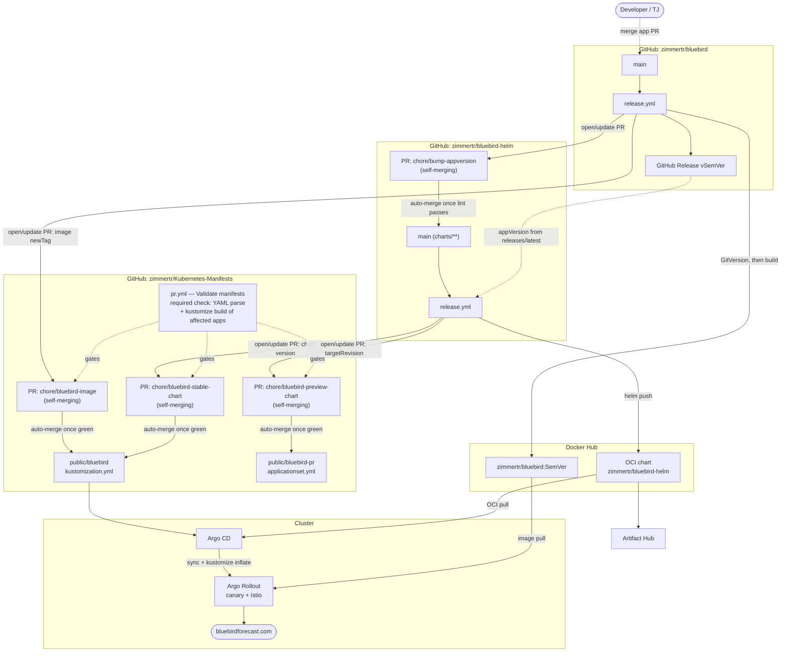
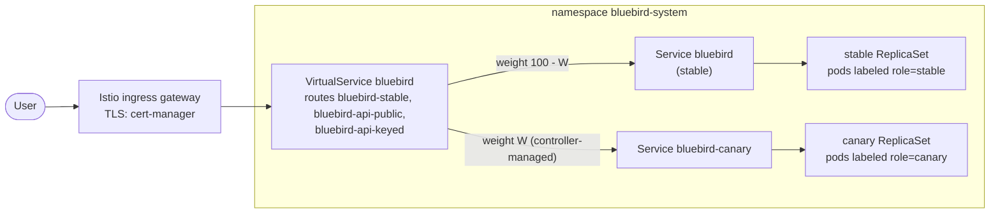
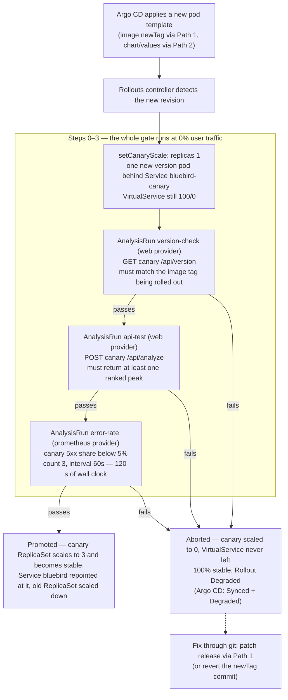
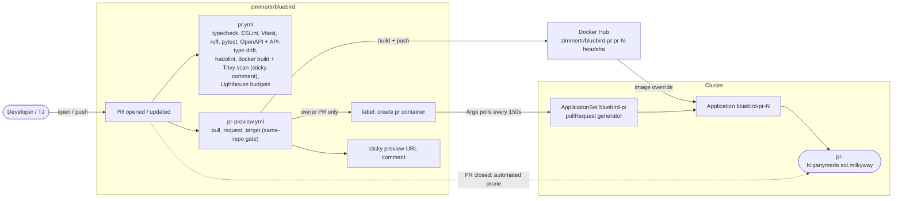
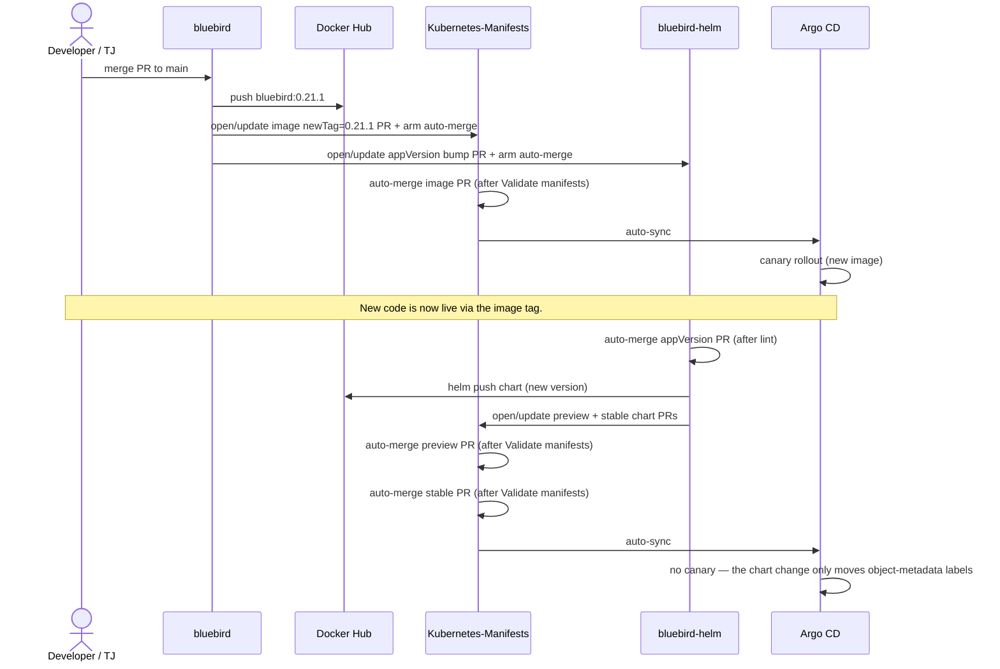

# CI/CD and Deployment Flow

How a change travels from a pull request to `bluebirdforecast.com`, across the
three repositories and the supporting services that automate the path.

> **Keep this current.** Any change that alters the flow — a workflow in
> `bluebird` or `bluebird-helm`, an image/chart/tag convention, or the
> `Kubernetes-Manifests` wiring — must update this document in the same change.
> The diagrams also describe two sibling repos, so changes made *there* should
> come back here too; nothing enforces that automatically.

## Systems

| System | Role |
| --- | --- |
| **`zimmertr/bluebird`** | Application monorepo (FastAPI backend + React SPA), built into a single Docker image. |
| **`zimmertr/bluebird-helm`** | Helm chart (`charts/bluebird`, whose `name:` is `bluebird-helm`), published as an **OCI** artifact. Its `pr.yml` runs `Lint & render` and, on a same-repo chart PR, `Publish prerelease chart`, which pushes `<version>-pr<N>.g<sha>` to the same OCI repo with `artifacthub.io/prerelease` set so Artifact Hub never ranks a PR build as latest. |
| **`zimmertr/Kubernetes-Manifests`** | GitOps repo Argo CD watches. `public/bluebird/` is the stable app; `public/bluebird-pr/` is the per-PR preview `ApplicationSet`. `main` forbids direct commits; every write lands via a PR gated on the `Validate manifests` check. |
| **Docker Hub** | `zimmertr/bluebird` (release images), `zimmertr/bluebird-pr` (preview images), and the OCI chart at `oci://registry-1.docker.io/zimmertr/bluebird-helm`. |
| **Artifact Hub** | Indexes the published OCI chart and security-scans its rendered **default image** (why the chart's `appVersion` must always name a real, published image tag). |
| **Cluster** | Argo CD (`argo-system`) syncing into `bluebird-system`; Argo Rollouts (canary + `AnalysisTemplate`), Istio `VirtualService`/`Gateway`, and cert-manager for `bluebirdforecast.com`. |

Everything consumes the chart **OCI-natively** (kustomize `helmCharts` and an
Argo CD `repoURL: oci://…`); nothing uses a classic Helm repo index.

## Release and promotion

Solid arrows are automated; dashed arrows are a human action, or a read that
doesn't itself trigger the next step.


```mermaid
flowchart TD
    dev(["Developer / TJ"])

    subgraph BB["GitHub: zimmertr/bluebird"]
        bbMain["main"]
        bbRel["release.yml"]
        ghRelease["GitHub Release vSemVer"]
    end

    subgraph HELM["GitHub: zimmertr/bluebird-helm"]
        helmPR["PR: chore/bump-appversion<br/>(self-merging)"]
        helmMain["main (charts/**)"]
        helmRel["release.yml"]
    end

    subgraph KM["GitHub: zimmertr/Kubernetes-Manifests"]
        kmCheck["pr.yml — Validate manifests<br/>required check: YAML parse<br/>+ kustomize build of affected apps"]
        kmImagePR["PR: chore/bluebird-image<br/>(self-merging)"]
        kmStablePR["PR: chore/bluebird-stable-chart<br/>(self-merging)"]
        kmPreviewPR["PR: chore/bluebird-preview-chart<br/>(self-merging)"]
        kmStable["public/bluebird<br/>kustomization.yml"]
        kmPreview["public/bluebird-pr<br/>applicationset.yml"]
    end

    subgraph DH["Docker Hub"]
        dhImage["zimmertr/bluebird:SemVer"]
        dhChart["OCI chart<br/>zimmertr/bluebird-helm"]
    end

    ah["Artifact Hub"]

    subgraph CL["Cluster"]
        argocd["Argo CD"]
        rollout["Argo Rollout<br/>canary + Istio"]
        prod(["bluebirdforecast.com"])
    end

    dev -.->|merge app PR| bbMain
    bbMain --> bbRel
    bbRel -->|GitVersion, then build| dhImage
    bbRel --> ghRelease
    bbRel -->|open/update PR: image newTag| kmImagePR
    bbRel -->|open/update PR| helmPR

    helmPR -->|auto-merge once lint passes| helmMain
    helmMain --> helmRel
    ghRelease -.->|appVersion from releases/latest| helmRel
    helmRel -->|helm push| dhChart
    dhChart --> ah
    helmRel -->|open/update PR: chart version| kmStablePR
    helmRel -->|open/update PR: targetRevision| kmPreviewPR

    kmCheck -.->|gates| kmImagePR
    kmCheck -.->|gates| kmStablePR
    kmCheck -.->|gates| kmPreviewPR
    kmImagePR -->|auto-merge once green| kmStable
    kmStablePR -->|auto-merge once green| kmStable
    kmPreviewPR -->|auto-merge once green| kmPreview

    kmStable --> argocd
    dhChart -->|OCI pull| argocd
    argocd -->|sync + kustomize inflate| rollout
    dhImage -->|image pull| rollout
    rollout --> prod
```

**Path 1 — App release** (`bluebird/release.yml`, on merge to `main`, runs
concurrency-serialized):

1. **Determine Version** — GitVersion (Mainline, conventional commits) computes
   the SemVer. **Immutability guard:** if `docker manifest inspect
   zimmertr/bluebird:<semver>` already exists, every downstream job skips.
2. **Build & Push** — builds a **multi-arch manifest (`linux/amd64` +
   `linux/arm64`, arm64 via QEMU)** with SBOM + provenance attestations (the
   attestation manifests appear as "unknown/unknown" rows in Docker Hub's UI),
   pushes it to Docker Hub as `zimmertr/bluebird:<semver>`, and pushes the
   `v<semver>` git tag. Capped at `timeout-minutes: 30`: because releases
   serialize, a job hung on a registry timeout would otherwise dam every
   queued release for up to GitHub's 6-hour default.

   Only the *backend* halves of the image are built per architecture. The
   frontend stage carries `--platform=$BUILDPLATFORM`, so the SPA is compiled
   once on the runner's own architecture and both images copy the same
   `dist/` — see [Where the time goes](#where-the-time-goes) for what the
   emulated version of that stage cost.

   **Build identity.** Three build args are passed here and baked into the
   image as env vars: `APP_VERSION` (the GitVersion SemVer), `APP_COMMIT`
   (`github.sha`), and `APP_BUILT_AT` (stamped by a `date -u` step, because
   `github.event.repository.updated_at` is the last push rather than this
   build). They are what `GET /api/version` reports and what fills
   `info.version` in `/openapi.json`. `pr-preview.yml` passes the same three,
   with `APP_VERSION=pr-<number>`, so a preview environment can be verified the
   same way. Anything built without them (a local `docker build`, `docker
   compose up`) honestly reports `dev`.

   These args are declared at the very **end** of the Dockerfile, immediately
   before `USER`. `APP_BUILT_AT` changes on every build, so declaring them any
   earlier would invalidate the `pip install` layer every time and throw away
   the build cache.
3. **Create GitHub Release** — auto-generated notes. Runs in parallel with
   step 4, which does not depend on it.
4. **Update Kubernetes-Manifests** — starts as soon as the image is pushed,
   because nothing here needs the GitHub Release to exist. A **self-merging
   PR** on the fixed `chore/bluebird-image` branch sets `images.newTag:
   <semver>` in
   `public/bluebird/kustomization.yml`. Once `Validate manifests` goes green it
   squash-merges itself, Argo CD auto-syncs, and the new image rolls to prod. No
   human step. See [Writes into Kubernetes-Manifests](#writes-into-kubernetes-manifests)
   for why every write is shaped this way.
5. **Bump Helm Chart appVersion** — waits on step 3, unlike step 4:
   `bluebird-helm/release.yml` resolves `appVersion` at package time from this
   repo's `releases/latest`, so opening this PR before the release exists races
   the resolver onto the previous version. Force-pushes a fixed
   `chore/bump-appversion` branch on `bluebird-helm` setting `Chart.yaml`
   `appVersion=<semver>`, opens
   **or updates in place** a single PR (Dependabot-style dedup), then arms
   **squash auto-merge** so it lands itself once `Lint & render` passes. No human
   step. Requires `GH_PAT` with contents + pull-requests write on `bluebird-helm`,
   and `allow_auto_merge` enabled on that repo.

   Same shape as every write into `Kubernetes-Manifests`, for the same reasons:
   `bluebird-helm/main` requires both a PR *and* the `Lint & render` check, and
   auto-merge must be re-armed on the update path because GitHub disables it on
   any force-push to the head branch. See
   [Writes into Kubernetes-Manifests](#writes-into-kubernetes-manifests).

**Path 2 — Chart release** (`bluebird-helm/release.yml`, on merge to `main`
touching `charts/**`, `artifacthub-repo.yml`, or the workflow itself):

1. GitVersion computes the **chart** SemVer. **Immutability guard:** `helm show
   chart oci://…` — skip if that chart version was already published.
2. Resolves `appVersion` **at package time** from `bluebird`'s `releases/latest`
   (the value committed to `Chart.yaml` is only a local-render fallback — the
   resolver is the source of truth), then `helm package --version <chartver>
   --app-version <appver>` and `helm push` to the OCI repo; tags + GitHub release.
3. **bump-manifests** moves `Kubernetes-Manifests` onto the new chart via two
   PRs, one per consumer:
   - preview: `chore/bluebird-preview-chart` sets `targetRevision: <chartver>`
     in `public/bluebird-pr/applicationset.yml` (the ephemeral per-PR envs).
     Always **self-merging** — nothing it touches reaches prod.
   - stable: `chore/bluebird-stable-chart` sets `helmCharts[0].version:
     <chartver>` in `public/bluebird/kustomization.yml` (prod, triggers the
     canary rollout). Also **self-merging**.

   They are separate branches rather than one PR touching both files so a
   preview bump is never blocked behind a prod change, and either can be closed
   independently. The chart release workflow is `concurrency`-serialized
   (`group: chart-release`): both branches are force-pushed, so two concurrent
   runs would clobber each other and leave the surviving PR pinned to whichever
   version pushed last.

   The fixed branch matters: version-suffixed branch names were the norm here
   until they stranded 6 open PRs across three chart releases while prod stayed
   pinned to an old chart. A new branch per version means `gh pr create` opens a
   new PR every time instead of advancing the existing one.

**Path 3 — GitOps sync** (Argo CD → cluster): Argo CD reconciles
`public/bluebird/`. Kustomize inflates the OCI `helmCharts` entry with
`values.yml`, overlays the namespace and the two `AnalysisTemplate`s, and pins
the image via `images.newTag`. The chart renders an **Argo Rollout** plus the
Istio `VirtualService`/`Gateway`; cert-manager terminates TLS. The rollout
itself is a three-step canary — one canary pod held at zero user traffic
through three blocking analyses, then promoted in a single cutover — described
in [Inside the prod canary](#inside-the-prod-canary-argo-rollouts) below.

### Two independent knobs reach prod

- **Image tag** — Path 1, a self-merging PR (`chore/bluebird-image`).
- **Chart version (stable)** — Path 2 → Path 3, a self-merging PR
  (`chore/bluebird-stable-chart`); prod, and the one that triggers a canary.
- **Chart version (preview)** — Path 2, a self-merging PR
  (`chore/bluebird-preview-chart`); ephemeral per-PR environments only, so it
  never touches prod.

A routine code change ships via the image tag alone; the chart version only
moves when the chart itself changes (or its default `appVersion` is bumped).
A chart change is reviewed in `bluebird-helm`, on the PR that writes it, where
the diff is the actual edit rather than a version string; the
`Kubernetes-Manifests` bump is the delivery of an already-reviewed chart.

### Writes into Kubernetes-Manifests

`Kubernetes-Manifests/main` **forbids direct commits**. All three automated
writes above go through a PR, and the thing they wait on is `pr.yml` /
**`Validate manifests`**, a required check in that repo which:

1. YAML-parses every changed `.yml`/`.yaml`. This is the failure mode the bump
   jobs can actually cause — the two chart bumps rewrite version lines with
   targeted `sed` (the image bump uses `kustomize edit set image`), and a regex
   matching more than intended corrupts the file.
2. Renders every kustomization affected by the PR with `kustomize build
   --enable-helm` (nearest-ancestor mapping from changed files, skipping
   `deprecated/` and `*.disable*`). A chart version or image tag that doesn't
   resolve fails the PR instead of failing an Argo CD sync. A PR that touches
   `pr.yml` itself adds `public/bluebird` to its own render list, so a tool bump
   cannot pass green on an empty target list.

A fourth writer into that repo is not one of these jobs: Renovate
(`.github/renovate.json`) auto-merges minor and patch updates after a seven-day
release age, gated on the same `Validate manifests` check.

Three constraints hold this together, and breaking any one of them silently
strands the automation:

- **Auto-merge needs something to wait on.** `gh pr merge --auto` is rejected on
  a PR with nothing blocking it (`Pull request is in clean status`). The
  required check is what makes the queue non-empty; without it, arming
  auto-merge errors out. Each Kubernetes-Manifests writer falls back to a plain
  `gh pr merge --squash` to cover the narrow window where the check already went
  green; Path 1's `bluebird-helm` appVersion PR is the exception and arms
  `--auto` only.
- **Auto-merge is re-armed on every release**, on the update path as well as
  the create path, because GitHub disables it on any force-push to the head
  branch — and every one of these jobs force-pushes its fixed branch each
  release. On a failing required check GitHub disarms auto-merge itself and
  notifies the arming account.
- **"Require branches to be up to date" must stay off** (`strict: false`). These
  branches are cut fresh off `main` and force-pushed; nothing ever rebases them,
  so requiring an up-to-date branch would deadlock whichever PR merged second.

The `GH_PAT` used for all of this needs contents + pull-requests write on
`Kubernetes-Manifests`, and `allow_auto_merge` must be on there. Concurrent
writes to the *same* file are safe: the image tag and the stable chart version
both live in `public/bluebird/kustomization.yml` but on lines far enough apart
that a three-way merge of the two branches never conflicts.

### What a stable chart bump costs

Most chart releases are `appVersion`-only and change nothing in prod's render:
`bluebird.labels` — the only helper carrying `app.kubernetes.io/version` — is
applied to *object* metadata, while the Rollout's pod template uses
`bluebird.selectorLabels`, which omits it; and `bluebird.image` does default to
`.Chart.AppVersion`, but KM's `images:` transformer pins an explicit `newTag`
that wins. The pod template is unchanged, so merging such a bump triggers no
canary at all.

A chart release that *does* change prod — a new default, a new resource — rolls
out as a canary like any other pod-template change, and `Validate manifests` has
already rendered it against prod's `values.yml`.

The case to watch is a chart change that needs a matching edit to
`public/bluebird/values.yml`, which the bot does not make. Helm silently ignores
a value whose key the chart no longer reads, so the render still succeeds while
that setting quietly reverts to the chart default. Nothing in this pipeline
catches it; the place to catch it is the `bluebird-helm` PR that renames or
drops the value, by shipping the `Kubernetes-Manifests` edit alongside it.

> A branch-guarded render-diff step used to sit at the end of `Validate
> manifests`, failing any `chore/bluebird-stable-chart` PR whose prod render
> moved. Removed in Kubernetes-Manifests #550. It keyed on `github.head_ref`, so
> its only escape was reopening the identical one-line diff from a
> differently-named branch (#494 → #497), and because the bot branch is fixed
> and force-pushed, one held version blocked every later one. It held 2 of 30
> bumps, both intended chart-default changes, and left prod eight chart versions
> behind.

## Inside the prod canary (Argo Rollouts)

Every path above ends the same way: Argo CD applies a change to the Rollout's
**pod template** — the image tag (Path 1) or the chart/values (Path 2 → 3) —
and the Argo Rollouts controller takes over. This section is what "canary
rollout" means concretely in this cluster. There are **no `pause` steps and no
manual promotion**: a release either promotes itself to 100% or aborts itself
back to stable, which is what makes the unattended loops in the next section
safe — a Dependabot auto-merge faces exactly the same gates as a hand-cut
release.

The moving parts ("KM" = `Kubernetes-Manifests/public/bluebird/`):

| Resource | Comes from | Role |
| --- | --- | --- |
| `Rollout bluebird` | chart `workload.yaml`; strategy, steps, and history limits from KM `values.yml` | the workload — `useRollout: true` turns the chart's Deployment into a Rollout |
| `Service bluebird` / `bluebird-canary` | chart | stable/canary endpoints; the controller injects `rollouts-pod-template-hash` selectors so each always tracks the right ReplicaSet |
| `VirtualService bluebird` | chart | the three weighted routes `bluebird-stable`, `bluebird-api-public` and `bluebird-api-keyed`, whose destination weights the controller owns |
| `AnalysisTemplate version-check` | KM `resources/analysisTemplate-versionCheck.yml` | identity gate — the canary must serve the exact image being rolled out |
| `AnalysisTemplate api-test` | KM `resources/analysisTemplate-apiTest.yml` | functional gate — a real `/api/analyze` through Overpass and Open-Meteo |
| `AnalysisTemplate error-rate` | KM `resources/analysisTemplate-errorRate.yml` | soak gate — the canary's 5xx share read from Prometheus, three times a minute apart |

The first two gates are Argo `web` providers and the third is a `prometheus`
provider, so the controller makes every call itself: a release starts no Job
pods and mounts no scripts.

### The data plane

cert-manager terminates TLS at the Istio ingress gateway, which routes by the
`bluebird` VirtualService. Its named routes `bluebird-stable` (the SPA), `bluebird-api-public` (the API
allowlist) and `bluebird-api-keyed` (the keyed analyze routes) each carry two
weighted destinations —
the stable and canary Services — and the Rollouts controller owns those weights
while a release is in flight. The public hostnames reach the gateway through a
Cloudflare Tunnel; [TRAFFIC.md](TRAFFIC.md) has that half:


```mermaid
flowchart LR
    user(["User"])
    gw["Istio ingress gateway<br/>TLS: cert-manager"]

    subgraph NS["namespace bluebird-system"]
        vs["VirtualService bluebird<br/>routes bluebird-stable, bluebird-api-public,<br/>bluebird-api-keyed"]
        ssvc["Service bluebird<br/>(stable)"]
        csvc["Service bluebird-canary"]
        srs["stable ReplicaSet<br/>pods labeled role=stable"]
        crs["canary ReplicaSet<br/>pods labeled role=canary"]
    end

    user --> gw --> vs
    vs -->|"weight 100 - W"| ssvc --> srs
    vs -->|"weight W (controller-managed)"| csvc --> crs
```

`trafficRouting.istio` in KM `values.yml` is what hands those weights to the
controller. It is not optional decoration: the `setCanaryScale` step below is
rejected without it, because absent a router Argo derives the canary's traffic
share from its replica count — the very dial `setCanaryScale` overrides. Prod
sat `Degraded` on exactly that once, when a comment-trimming commit deleted the
block and left the step behind.

### The four steps

Prod runs an HPA, `minReplicas: 3` to `maxReplicas: 10`, and the chart omits
`spec.replicas` so Argo CD never fights it. The canary is pinned to a single pod for the whole
gate, so a release adds one pod rather than a second full set, and it adds it
without moving any user traffic onto it.


```mermaid
flowchart TD
    apply["Argo CD applies a new pod template<br/>(image newTag via Path 1, chart/values via Path 2)"]
    detect["Rollouts controller detects the new revision"]

    subgraph GATE["Steps 0–3 — the whole gate runs at 0% user traffic"]
        scale["setCanaryScale: replicas 1<br/>one new-version pod behind Service bluebird-canary<br/>VirtualService still 100/0"]
        vc["AnalysisRun version-check (web provider)<br/>GET canary /api/version<br/>must match the image tag being rolled out"]
        at["AnalysisRun api-test (web provider)<br/>POST canary /api/analyze<br/>must return at least one ranked peak"]
        er["AnalysisRun error-rate (prometheus provider)<br/>canary 5xx share below 5%<br/>count 3, interval 60s — 120 s of wall clock"]
    end

    done["Promoted — canary ReplicaSet scales to 3 and becomes stable,<br/>Service bluebird repointed at it, old ReplicaSet scaled down"]
    abort["Aborted — canary scaled to 0, VirtualService never left<br/>100% stable, Rollout Degraded<br/>(Argo CD: Synced + Degraded)"]
    fix["Fix through git: patch release via Path 1<br/>(or revert the newTag commit)"]

    apply --> detect --> scale --> vc
    vc -->|"passes"| at
    at -->|"passes"| er
    er -->|"passes"| done
    vc -->|"fails"| abort
    at -->|"fails"| abort
    er -->|"fails"| abort
    abort -.-> fix
```

**Step 0 — `setCanaryScale: {replicas: 1}`.** One pod of the *new* version comes
up behind `Service bluebird-canary`, whose hash selector the controller has
already repointed at the canary ReplicaSet. The VirtualService is untouched at
100/0, so ordinary users keep hitting stable for the entire gate. The step
completes only once that pod counts as Available, which means both analyses
below are guaranteed to run against a Ready pod and neither needs its own
startup grace.

**Step 1 — `version-check`, the identity gate.** A `web` provider GETs
`http://bluebird-canary.bluebird-system.svc.cluster.local:8000/api/version` and
reads `$.version`. The step passes the image being rolled out into the template
via `fieldRef` on `spec.template.spec.containers[0].image`, so the condition is
`hasSuffix("{{args.version}}", ":" + result)` — the canary must report the exact
release, not merely something semver-shaped. The `:` is load-bearing: it anchors
the comparison so a canary reporting `0.29.6` cannot satisfy an image tagged
`10.29.6` or `0.29.60`. `count: 1`, `failureLimit: 0` — nothing external is in
the path, so there is nothing legitimate to flake and nothing to retry.

**Step 2 — `api-test`, the functional gate.** Same provider, a single POST to
the canary's `/api/analyze` with a fixed body: a known-good polygon (Tiger
Mountain, Issaquah WA), `destination_types: [peak]`, `forecast_mode: current`,
`limit: 3`. One condition covers the whole chain — `len(result.results) >= 1` is
satisfiable only if Overpass discovered candidates, the ranking produced rows,
and Open-Meteo attached a forecast to them. `count: 1`, `failureLimit: 0`, 120 s
timeout. The flip side is deliberate: an extended Overpass or Open-Meteo outage
*blocks* releases rather than skipping validation, on the grounds that a release
which cannot serve a real analysis is not healthy whatever the reason.

Both gates hit the canary Service in-cluster rather than the public hostname,
which is why the controller needs no route back in through the gateway. The
cost is that ingress and TLS are no longer on the gate path; they are covered by
the stable traffic that never stopped flowing.

**Step 3 — `error-rate`, the soak gate.** A `prometheus` provider reads the
canary pods' 5xx share —
`bluebird_forecast_http_requests_total{role="canary",status=~"5.."}` over the
same series without the status filter, both as a 2-minute rate — and requires
it below `0.05`. `count: 3`, `interval: 60s`, `failureLimit: 1`: three readings
a minute apart, of which one may fail. **This is 120 s of wall clock and the
single largest segment of the whole merge-to-live path** (see [Where the time
goes](#where-the-time-goes)).

Two things about it are worth stating plainly, because they bound what the
120 s buys. The `role` label is real — it reaches Prometheus through the
Rollout's `canaryMetadata`, verified against the live series — so the query is
not silently scoped to nothing. But the canary sits at **0% user traffic** for
the entire gate, so the only requests in that window are the two analysis
probes above plus the metrics scrape. What the gate therefore detects is a pod
that 5xxs on its own, or on a scrape, rather than a pod that 5xxs under real
load. `or vector(0)` / `clamp_min(…, 1e-9)` make the no-traffic case read as a
clean `0` rather than as an error, which is why an idle canary passes rather
than flaking.

**Promotion.** There is no weighted soak: once step 3 passes, the step index
moves past the end of the list, which lifts the `setCanaryScale` pin. The canary
ReplicaSet scales up to whatever the HPA asks for, three at the floor, *becomes* stable — the controller
repoints the `bluebird` Service's hash selector at it and returns the route to
100/0 against the new pods — and the old ReplicaSet scales down. The cutover is
therefore all-at-once after the gate rather than gradual. History is kept
deliberately short for Argo CD UI legibility by a single knob:
`revisionHistoryLimit: 1`, current plus one previous ReplicaSet. That one knob
bounds `AnalysisRun`s too, because a run whose ReplicaSet is gone is deleted
outright, so what survives is the gates of the last two releases. The
`successfulRunHistoryLimit` / `unsuccessfulRunHistoryLimit` counts are
deliberately **not** set: the controller's defaults sit above that cap and
never bind, and a count low enough to bind is a trap. Those counts are per
Rollout rather than per release, so anything below the number of analysis steps
deletes a gate's run the instant it passes — which is what a former
`successfulRunHistoryLimit: 1` did, leaving green releases looking like they
had only ever run one gate.

**Abort.** If any of the three analyses fails — or someone runs `kubectl argo
rollouts abort` — the canary ReplicaSet scales to zero and the Rollout reports
**Degraded**. Nothing has to snap back: the stable ReplicaSet was never scaled
down and the VirtualService never left 100% stable, so no user request was ever
served by the version that failed.

### How this coexists with Argo CD

The `bluebird` Application is generated by the `public` ApplicationSet
(`Kubernetes-Manifests/public/applicationset.yml`) with automated sync, prune,
and **`selfHeal`** — which would instantly revert the controller's weight
edits mid-rollout. The ApplicationSet therefore carries an
`ignoreDifferences` jq rule matching exactly the destination weights on the
three routes the controller weights (`-stable`, `-api-public`, `-api-keyed`),
so live weight drift is invisible to the diff. A weighted route missing from
that rule is one `selfHeal` would put back mid-rollout. Argo CD's health assessment understands Rollouts natively: the app shows
*Progressing* during a canary, *Healthy* at promotion, and *Degraded* after an
abort **while still being Synced** — an aborted rollout is Rollouts state, not
git drift, so `selfHeal` won't retry it. Remediation flows through git like
everything else: ship a fixed patch release via Path 1 (or revert the `newTag`
commit in `Kubernetes-Manifests`); the next pod-template change supersedes the
aborted revision and starts a fresh canary. `kubectl argo rollouts retry`
exists for one-off flakes, but the normal path is git.

## Where the time goes

Measured on 2026-09-15 from the GitHub Actions API, the Argo CD `Application`'s
sync history, and the Argo Rollouts controller's own log (issue #368). Every
number below is an observation, not a budget. Re-measure before citing one: the
method is written beside each figure so it can be repeated.

### The pull request path

`pr.yml`, 15 successful runs carrying `Lighthouse Budgets` (that job landed in
#367; runs before it had a 62 s median, and the older figure is not comparable).

| Job | Median | Range |
| --- | --- | --- |
| `Lighthouse Budgets` | 92 s | 81–124 s |
| `Docker Build` | 57 s | 38–63 s |
| `Backend Tests` | 29 s | 27–33 s |
| `Frontend Typecheck & Tests` | 26 s | 24–31 s |
| `Python Lint` | 9 s | 6–10 s |
| **whole run** | **147 s** | 140–193 s |

A sixth job stood in this table when it was measured, `Aggregation vectors in
sync` at a 6 s median, and #380 removed it: the browser's suite now reads the
backend's committed vectors rather than a copy, so there are no two files to
diff. The whole-run figure is unchanged, because that job was never on the
critical path.

The frontend job grew 5 s on 2026-09-15 when ESLint joined it (issue #379):
2 s to install the linter's own package and 3 s to lint 57 sources. It is not on
the critical path, so the whole run is unchanged.

The frontend job moved from Node 22 to Node 26 on 2026-09-22, when it began to
read `.node-version` (issue #401). Over four runs it measured a 31 s median
(26 to 43 s) against 29 s (25 to 35 s) for the twelve runs before. `setup-node`
now takes 5 to 6 s where it took under 1 s, because the runner image carries
Node 22 in its tool cache and downloads 26. Lint and Vitest ran no slower on 26.
The job is still off the critical path.

**The critical path is two jobs long**, and only two. Four jobs start within
about 3 s of each other; three of them finish while `Docker Build` is still
building. `Lighthouse Budgets` `needs` it, so it starts at about 63 s and adds
its own 92 s. Everything else is free.

Inside `Docker Build`, by median: the image build 21 s, the Trivy scan 11 s,
building the hadolint **Docker action** 5.5 s, `setup-buildx` 4 s, job setup
3 s, the smoke test 3 s.

Inside `Lighthouse Budgets`: the audit itself 52 s, then **24 s of getting back
to an image that already existed** — `setup-buildx` 8 s and a cache-replay
build 16 s. That hand-off was chosen over passing a 200 MB image between jobs
and has never been timed against the alternative; 24 s is what it costs, and it
is now on the path a person waits on.

Three consequences, and two of them are reasons *not* to optimise:

- **Nothing done to the three short jobs moves the wall clock.** They finish
  inside `Docker Build`. This is why caching pip in the Python jobs was measured
  and then removed rather than kept: see the `setup-python` comments in
  `pr.yml`.
- **The Trivy database is already cached.** `trivy-action` wraps its own
  `actions/cache` around both the pinned binary (42 MB, 2.1 s to restore) and
  the vulnerability DB (80 MB, 3.7 s), keyed `cache-trivy-<date>` with
  `restore-keys: cache-trivy-`. `image-scan.yml` uses the same action and
  therefore the same key, so the two already share one copy. There is nothing
  to add.
- **The npm cache was costing more than it saved.** `npm ci` measured 4 s on a
  cold cache and 4–5 s on a warm one, while restoring the cache cost 2 s inside
  `setup-node`. It also held 50 entries and 2.80 GB. Removed.

**`pr.yml` triggers on `pull_request` only.** It used to carry a `push` trigger
as well, and ran the whole workflow twice per commit: the two events name
different refs, so the `concurrency` group could not collapse them, and all 20
sampled runs were such a pair. They ran in parallel, so nobody waited longer —
the cost was a second set of runners per commit and two races to write the same
cache keys, which fed straight into the budget problem below. The trade is that
a branch pushed with no pull request open gets no checks until one is opened.
Every check branch protection requires is a `pull_request` check anyway.

Branch protection requires four contexts: `Python Lint`, `Docker Build`,
`Frontend Typecheck & Tests` and `Backend Tests`. **A job here cannot be
renamed or deleted on its own**: branch protection matches the name exactly,
and a name it requires that no longer reports strands every open pull request.
`Aggregation vectors in sync` was a fifth from 2026-09-15 until #380 deleted
the job, and it had to leave the required list in the same change.

### The repository's Actions cache

Measured 2026-09-15, and the single largest source of variance in every build
number on this page: **10.73 GB across 1,297 entries**, against GitHub's 10 GB
per repository. Over the limit means evicting least-recently-used entries
continuously, and what gets evicted is the buildx layer cache that `Docker
Build`, `Lighthouse Budgets` and `Build & Push` all read. A layer cache that is
sometimes there is what `Docker Build` ranging 38–63 s and `Build & Push`
ranging 36–142 s look like.

Where it was going:

| Holder | Entries | Size |
| --- | --- | --- |
| caches on **closed** pull requests' merge refs | 428 | 3.40 GB |
| `setup-node` npm caches, one ~56 MB copy per branch | 50 | 2.80 GB |
| everything else, mostly live buildx scopes | 819 | 4.53 GB |

GitHub scopes a cache to the ref that wrote it and **never reclaims a closed
pull request's** — 18 closed, merged pull requests were still holding 32% of
the whole budget. `cache-cleanup.yml` now deletes a pull request's caches when
it closes, and the npm cache is gone, which together is about 6.2 GB that stops
competing with the Docker layers.

Caches expire on their own after 7 days unread, so the cleanup only removes
entries that were going to die anyway; it removes them on the day the pull
request closes instead. To reclaim an existing backlog by hand, from a token
with `actions: write`:

```bash
gh cache list --limit 100 --json id,ref --jq '.[] | select(.ref | startswith("refs/pull/")) | .id' \
  | xargs -n1 gh cache delete
```

### The release path

`release.yml`, 20 full releases. Jobs hand off in about 2 s.

| Job | Median | Range |
| --- | --- | --- |
| `Determine Version` | 16 s | 12–31 s |
| `Build & Push` | 92 s | 36–142 s |
| `Create GitHub Release` | 13 s | 11–16 s |
| `Update Kubernetes Manifests` | 11 s | 8–18 s |
| `Bump Helm Chart appVersion` | 10 s | 8–13 s |
| **whole run** | **151 s** | 88–311 s |

`Build & Push` is the multi-arch build, and within it one step dominates.
In release run `34916818009` the **arm64 `npm run build` took 35.6 s against
3.0 s for the identical amd64 step** — the emulation penalty on the one stage
whose output does not depend on the architecture at all. Everything else in the
arm64 half was a cache hit. That is why the Dockerfile's frontend stage is
pinned with `--platform=$BUILDPLATFORM`: the stage runs once, natively, and both
images copy the same `dist/`. Verified output-neutral by building the frontend
for amd64 and cross-building it from arm64 and hashing `/app/static` in each
resulting image: identical, 21 files.

`Update Kubernetes Manifests` does **not** wait on `Create GitHub Release`.
Nothing it does needs the release to exist — it links to a URL that resolves by
the time a human opens the PR — so waiting put 13 s of release-note generation
in front of every production deploy. `Bump Helm Chart appVersion` still does
wait, and must: `bluebird-helm/release.yml` resolves `appVersion` at package
time from `repos/zimmertr/bluebird/releases/latest`, so opening that PR early
races the resolver onto the previous version.

### Merge to live

The path a human actually waits on, end to end. Segment medians, from the
sources named in the last column.

| Segment | Median | Range | Measured from |
| --- | --- | --- | --- |
| squash-merge → image bump PR opened | 133 s | 88–168 s | `release.yml` run start → `Update Kubernetes Manifests` end (n=20) |
| image bump PR open → merged | 20 s | 14–47 s | `chore/bluebird-image` PR `created_at` → `merged_at` (n=30) |
| merged → Argo CD begins syncing | 43 s | 4–182 s | merge commit → `Application.status.history[].deployStartedAt` (n=9) |
| Argo CD applies the sync | 4 s | 3–8 s | `deployStartedAt` → `deployedAt` (n=9) |
| canary pod up (`setCanaryScale`) | 21 s | 21 s | Rollout step 0 → 1 (revisions 206, 207) |
| `version-check` | 1 s | — | Rollout step 1 → 2 (revision 206) |
| `api-test` | 13 s | 13–55 s | Rollout step 2 → 3 (revisions 206, 207) |
| `error-rate` | **120 s** | fixed | Rollout step 3 → 4 (revisions 206, 207) |
| promotion + service cutover | 23 s | 21–25 s | step 4 → `RolloutCompleted` |
| stable scale-up, old ReplicaSet down | 30 s | 30–31 s | `RolloutCompleted` → `RolloutHealthy` |
| **total** | **~6 min 50 s** | | |

Two segments are larger than anything else and neither is a workflow:

- **`error-rate`, 120 s.** `count: 3 × interval: 60s`, fixed by the template.
  It is the biggest single segment of the path and it is a deliberate gate, not
  a knob. Its limits are written up under [Step 3](#the-four-steps).
- **Argo CD detection, 0–182 s.** There is **no webhook**: the Argo CD server is
  a cluster-internal `LoadBalancer` with no public ingress, so `main` moving in
  `Kubernetes-Manifests` is discovered by polling. The cluster runs the chart
  defaults, `timeout.reconciliation: 120s` with
  `timeout.reconciliation.jitter: 60s`, which is exactly the 0–180 s window the
  nine observations fall in. Shortening the interval shortens the segment
  proportionally and a webhook would cut it to about a second, but both are
  cluster changes rather than workflow ones, and 43 s sits next to the 120 s
  gate that follows it. Left at the chart defaults deliberately (TJ,
  2026-09-15).

One more thing the canary log says, and the reason the numbers above exclude
revision 209: that release was promoted by hand. The controller logged
`Rollout completed update to revision 209: Full promotion requested`, and
`error-rate` was terminated after 1 of its 3 readings, 12 s into its 120 s.
Revisions 206 and 207 ran the full gate, which is why they are the ones
measured.

## PR preview environments

Every PR builds an image; **owner-authored** PRs additionally get a live,
per-PR preview environment.


```mermaid
flowchart LR
    dev(["Developer / TJ"])

    subgraph BB["zimmertr/bluebird"]
        pr["PR opened / updated"]
        checks["pr.yml<br/>typecheck, ESLint, Vitest, ruff, pytest, OpenAPI + API-type drift,<br/>hadolint, docker build + Trivy scan (sticky comment),<br/>Lighthouse budgets"]
        preview["pr-preview.yml<br/>pull_request_target (same-repo gate)"]
        label["label: create pr container"]
        comment["sticky preview-URL comment"]
    end

    dhpr["Docker Hub<br/>zimmertr/bluebird-pr:pr-N-headsha"]

    subgraph CL["Cluster"]
        appset["ApplicationSet bluebird-pr<br/>pullRequest generator"]
        app["Application bluebird-pr-N"]
        env(["pr-N.ganymede.sol.milkyway"])
    end

    dev -->|open / push| pr
    pr --> checks
    pr --> preview
    preview -->|build + push| dhpr
    preview -->|owner PR only| label
    preview --> comment
    label -->|Argo polls every 150s| appset
    appset --> app
    dhpr -->|image override| app
    app --> env
    pr -.->|PR closed: automated prune| env
```

- `pr.yml`'s backend job runs `scripts/generate_openapi.py --check` after pytest.
  `backend/openapi.json` is committed so an API change lands as a reviewable diff
  instead of hiding inside Python, and this step fails the PR when the app and
  the snapshot disagree. Regenerate with `cd backend && python
  scripts/generate_openapi.py`. The script pins `APP_VERSION` to `dev` before
  importing the app, so `info.version` stays deterministic and a released build
  never reads as drift.
- `pr.yml`'s frontend job runs on the Node major named in `.node-version`,
  which `setup-node` reads through `node-version-file`. That file is the one
  place the major is written: the root `Makefile` reads it for every local
  check, and the `Dockerfile` keeps a literal `node:<major>-alpine` tag, because
  a `FROM` line reads no file and a build argument would hide the tag from
  Dependabot. `backend/tests/test_node_version.py` fails when that tag and the
  file disagree, so CI always tests the runtime the image builds with.
- `pr.yml`'s frontend job runs `npm run check:api` before the typecheck. The
  SPA's wire types are hand-written, and `frontend/src/api-schema.d.ts` —
  generated from the committed snapshot above — is what the typecheck holds them
  against, so the same contract change has to land on both sides of the repo in
  one PR. Regenerate with `cd frontend && npm run generate:api`. The generator
  is a package of its own (`frontend/tools/api-types`, with its own lockfile and
  its own Dependabot entry) because it needs the TypeScript 5 compiler API while
  the app runs TypeScript 7; the script installs it, so the job adds no step.
- `pr.yml`'s frontend job then runs **ESLint** (`npm run lint`), after the
  typecheck and before Vitest. It is `frontend/tools/eslint`, a second package
  apart for a sharper version of the same reason: typescript-eslint refuses
  TypeScript 7 outright, so the linter carries its own TypeScript 6. The rules
  are typescript-eslint recommended, `react-hooks/rules-of-hooks` and
  `react-hooks/exhaustive-deps` as errors, and the syntactic class and metric
  bans that used to be regular expressions inside `styles.test.ts` and
  `metrics.test.ts`. Warnings fail the job (`--max-warnings 0`), which is what
  makes a suppression that silences nothing a build error. The script then runs
  `tools/eslint/selftest.js`, which lints ten fixtures and fails unless each ban
  reports its own violation and nothing else: a selector that matches nothing
  otherwise reads as a clean tree.
- `pr.yml`'s docker-build job loads the amd64 image into the runner and scans it
  with **Trivy** (`ignore-unfixed`: Debian/Alpine no-fix CVEs never gate). The
  report lands in the job step summary and as a **sticky PR comment** (matched by
  a hidden `<!-- bluebird-image-scan -->` marker, not `--edit-last`, so it can't
  clobber the preview-URL comment). The job fails only on **fixable
  Critical/High** findings. File-level exclusions live in **`trivy.yaml`** at the
  repo root, read by this job and by `image-scan.yml` below, so the gate that
  admits an image and the gate that re-checks it later cannot disagree. Each
  entry there carries its reasoning; today the only one is pip's vendored-source
  SBOM, which Trivy would otherwise read as installed inventory. What counts as
  a Critical/High is one composite action, **`.github/actions/trivy-crit-high`**,
  called by this job and by `image-scan.yml`: both workflows once spelled the
  same `jq` filter, so a filter corrected in one could keep admitting images in
  the other.
- `pr.yml`'s **Lighthouse Budgets** job runs after `docker-build`, rebuilds from
  that job's warm Actions cache, serves the real image, and audits `/` three
  times with **Lighthouse CI**. It fails the PR when the first screen crosses a
  byte or timing budget. The budgets and the reasoning live in
  **`.github/lighthouserc.js`**; two choices there make it a gate rather than a
  weather report: every third-party host is blocked (a gate that goes red when
  OpenFreeMap is slow teaches everyone to ignore it), and the default mobile
  preset is used, whose throttling is a simulation and therefore reproducible to
  the millisecond. It reports as `Lighthouse Budgets`, and adding it to branch
  protection is a manual step in the repository settings.
- `pr-preview.yml` runs under **`pull_request_target`** (so it can reach the base
  repo's secrets to push images) behind a **hard same-repo gate** — fork PRs
  never execute with secrets. It builds `zimmertr/bluebird-pr:pr-<N>-<head_sha>`.
- For the owner's own PRs it applies the **`create pr container`** label and posts
  a sticky comment with the preview URL. Other authors (e.g. Dependabot) still
  build an image but get no label, so no preview pod spins up.
- Argo CD's `bluebird-pr` `ApplicationSet` uses a `pullRequest` generator that
  polls GitHub for the label every 150s and templates `bluebird-pr-<N>` from the
  OCI chart, overriding the image tag, setting `publishFullApi: true` (the #240
  allowlist is off in a preview, so its analyze routes need no key), and
  injecting the `PREVIEW_BANNER` / `PREVIEW_PR` / `PREVIEW_COMMIT` env
  (surfaced by `/api/config` → the SPA banner) plus `LOG_LEVEL=TRACE`. Closing
  the PR prunes the environment, and `cache-cleanup.yml` deletes that PR's
  Actions caches.

## Unattended maintenance

Two loops keep shipped artifacts current with nobody initiating a change: a
weekly re-scan of the released image, and Dependabot dependency PRs with patch
auto-merge. Both funnel into Path 1, so the [prod
canary](#inside-the-prod-canary-argo-rollouts) still gates everything they
produce. The next two sections give the details.


```mermaid
flowchart LR
    subgraph SCAN["Weekly image re-scan"]
        cron["image-scan.yml<br/>cron, Trivy"]
        released["Docker Hub<br/>latest released image"]
        sarif["Security tab<br/>SARIF alerts"]
        email["failure email<br/>fixable Crit/High only"]
    end

    subgraph DEP["Dependency updates"]
        bot["Dependabot<br/>weekly PRs"]
        am["dependabot-auto-merge.yml"]
        note["armed comment on PR"]
        merge["squash auto-merge<br/>after required checks"]
        review(["TJ reviews<br/>minor / major"])
    end

    rel["release.yml<br/>Path 1: canary to prod"]

    cron -->|scan| released
    cron --> sarif
    cron -->|only when actionable| email
    email -.->|fix: merge base-image PR| bot

    bot --> am
    am -->|patch| note
    am -->|patch| merge
    bot -->|minor / major| review
    merge --> rel
    review -.-> rel
```

## Scheduled image scan

PR-time scanning gates what gets *published*, but CVEs are disclosed after
images ship. The released image rots while nothing rebuilds it.
`image-scan.yml` (weekly cron + `workflow_dispatch`) re-scans the **latest
released** `zimmertr/bluebird:<semver>` with Trivy:

- **Always:** SARIF upload → code-scanning alerts in the repo **Security tab**.
- **Gate:** the job fails — triggering GitHub's workflow-failure email — only
  when a **fixable Critical/High** vulnerability exists, i.e. only when there
  is something to do. It re-scans as JSON and counts through the same
  **`.github/actions/trivy-crit-high`** the PR gate uses, so the two gates
  judge an image by one definition. Expected remediation: merge the open
  Dependabot base-image PR (below), which cuts a patch release on the fresh
  base and rolls it out through Path 1.

**When there is no base-image PR to merge.** Alpine fixes a package days to
weeks before the `python:3.14-alpine` image rebuilds carrying it, so the tag
can be current while the packages under it are not. Dependabot's `docker`
ecosystem only moves tags, so it has nothing to open, and this is the case
that failed the 2026-09 scans (seven fixable HIGH util-linux CVEs against a
base tag that was already the newest published). The Dockerfile answers it
with `RUN apk upgrade --no-cache` in the runtime stage, which pulls the
current Alpine index at build time rather than waiting on the base.

That layer is a snapshot, not a live upgrade: BuildKit keys it on the base
digest plus the command, so between base moves every build serves the cached
copy. A fix Alpine publishes into that gap is therefore invisible until the
base moves. **The remedy is a cacheless rebuild** — `gh cache delete --all`,
then release — not a dependency bump. The weekly scan here is what makes that
gap visible, which is the only reason the cache is safe to keep.

This job scans a published image rather than a checkout, so its `actions/checkout`
step exists purely to read `trivy.yaml`. That is deliberate: without the PR gate's
exclusions, an image could pass `pr.yml` and then fail here on findings that gate
had already ruled out.

Docker Hub's Scout insights cover the same registry-side rot but only update
the Hub dashboard; the cron's failure email is the push-based signal.

## Dependabot auto-merge

Dependabot opens weekly PRs (`pip` in `/backend`, `npm` in `/frontend`,
`/frontend/tools/api-types` and `/frontend/tools/eslint`, `github-actions` and
`docker` base images in `/`).
The type generator's package ignores TypeScript **major** bumps: it is pinned to
5 because `openapi-typescript` loads the compiler API and peers on `^5.x`, which
is why it is a package apart from the app in the first place. The linter's
package ignores them for the same reason, one major later: typescript-eslint
throws on TypeScript 7 rather than degrading, so that package stays on 6. `dependabot-auto-merge.yml` enables **squash
auto-merge for patch (bugfix) bumps only** — GitHub completes the merge once
`main`'s required checks pass; **minor and major bumps wait for manual review**.
When it arms auto-merge it also posts a marker-guarded comment on the PR saying
so (and how to stop it), so the self-merge is visible from the PR page rather
than something to infer from the merge timeline.

In practice only `pip`/`npm` patches auto-merge, plus three exactly pinned
actions (hadolint, trivy-action, lighthouse-ci-action) whose patch bumps do
auto-merge: every other GitHub Action is major-pinned (`@v7`, `@v4`, `@v3`), so
Dependabot raises them as *major* bumps that wait for review anyway. The Dockerfile's base tags float at the minor (`python:3.14-alpine`,
`node:26-alpine`), so docker-ecosystem PRs are minor/major runtime bumps that
also wait for review. A Node major bump also fails `Backend Tests` until the
same PR moves `.node-version` to match, which is what keeps CI on the image's
runtime. Base-OS *patch* fixes arrive without any PR, picked up
by whatever build happens next. The merge PAT is intentionally scoped to Contents + Pull requests
(not `Workflows`), so a workflow-file edit is not something it can land on its
own, and those three actions' patch bumps still wait for a person even though
the job arms auto-merge on them.

The merge step runs with a PAT (`AUTO_MERGE_PAT`, stored as a **Dependabot**
secret — Actions secrets are empty in Dependabot-triggered runs), *not* the
default `GITHUB_TOKEN`. That's deliberate: a `GITHUB_TOKEN`-driven merge would be
suppressed by GitHub's recursion guard and never fire `release.yml`'s `on: push`,
so the patch would land on `main` but never ship. With the PAT, an auto-merged
patch deploys through Path 1 like any other merge — the prod canary still gates
the rollout.

The same trap applies to Path 1 step 5's auto-merged `appVersion` bump, which is
why that `gh pr merge` runs under `GH_PAT`: a `GITHUB_TOKEN`-driven merge there
would land the bump on `bluebird-helm/main` without ever firing Path 2, leaving
the chart unpublished.

## A single change, end to end


```mermaid
sequenceDiagram
    actor Dev as Developer / TJ
    participant BB as bluebird
    participant DH as Docker Hub
    participant KM as Kubernetes-Manifests
    participant HELM as bluebird-helm
    participant ARGO as Argo CD

    Dev->>BB: merge PR to main
    BB->>DH: push bluebird:0.21.1
    BB->>KM: open/update image newTag=0.21.1 PR + arm auto-merge
    BB->>HELM: open/update appVersion bump PR + arm auto-merge
    KM->>KM: auto-merge image PR (after Validate manifests)
    KM->>ARGO: auto-sync
    ARGO->>ARGO: canary rollout (new image)
    Note over Dev,ARGO: New code is now live via the image tag.
    HELM->>HELM: auto-merge appVersion PR (after lint)
    HELM->>DH: helm push chart (new version)
    HELM->>KM: open/update preview + stable chart PRs
    KM->>KM: auto-merge preview PR (after Validate manifests)
    KM->>KM: auto-merge stable PR (after Validate manifests)
    KM->>ARGO: auto-sync
    ARGO->>ARGO: no canary — the chart change only moves object-metadata labels
```

That last step is specific to an `appVersion`-only chart release, where the pod
template never changes. A chart release that alters prod's render lands the same
way and rolls out as a canary — see [What a stable chart bump
costs](#what-a-stable-chart-bump-costs).

## Conventions

- **GitVersion prefix → bump** (both repos): `feat!` / `BREAKING CHANGE:` →
  major; `feat:` → minor; `fix` / `perf` / `refactor` / `chore` / `docs` /
  `style` / `test` / `ci` → patch. The squash-merge commit message (the PR
  title) is what drives the release.
- **Immutability guards** in both release pipelines make merges idempotent: a
  re-run for an already-published image or chart version is a no-op.
