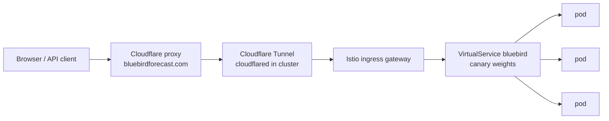

# Traffic: how requests reach Bluebird Forecast, and what Bluebird Forecast calls

[`CICD.md`](CICD.md) covers how code becomes a running deployment. This page
covers the running deployment's traffic: the path a request takes from a
browser to a pod, every external API the system talks to, and the rate
limiting that protects the shared free services underneath. It exists because
half of this configuration (Cloudflare, upstream usage policies) lives outside
this repo, and undocumented edge config is unreproducible edge config.

## Inbound: browser to pod



- **Cloudflare** proxies the zone (orange-cloud DNS). It terminates the public
  TLS session, hides the origin IP, and is where the coarse edge rate rule
  lives (below). It sets `CF-Connecting-IP` on every forwarded request, and
  overwrites any value the client sent.
- **The tunnel** is a `cloudflared` deployment in the cluster that dials out to
  Cloudflare ([#148](https://github.com/zimmertr/bluebird/issues/148)). The
  origin holds no inbound port, so there is no direct-to-origin path from the
  internet: every public request reaches a pod only after passing Cloudflare,
  which is what makes `CF-Connecting-IP` trustworthy for public traffic (see
  "Client identity" below). The internal `*.sol.milkyway` name still resolves
  straight to the gateway on the LAN and never traverses the tunnel. cloudflared
  forwards each hostname to the shared Istio ingress gateway with the public
  hostname as SNI, so Istio serves the right certificate and routes by Host
  unchanged. Its config lives in `Kubernetes-Manifests` under
  `public/cloudflared/`.
- **Istio** routes `bluebirdforecast.com` through the `bluebird`
  VirtualService to the stable/canary services managed by Argo Rollouts
  (autoscaled between 3 and 10 replicas; the canary adds one pod through its
  analysis steps and a full set at promotion).

There is deliberately **no Envoy/Istio rate limiting layer**. Istio still has
no first-class rate-limit API; the mechanism is a raw `EnvoyFilter` wrapping
`envoy.filters.http.local_ratelimit`, which is per-pod (same imprecision as
the app's own limiter), can't key on client address without brittle descriptor
config, and is the most version-sensitive kind of YAML in the stack. Both jobs
it could do are already covered: Cloudflare rejects floods before they cross
the ocean, and the app enforces the precise per-client and per-upstream
limits. Decision recorded in
[#75](https://github.com/zimmertr/bluebird/issues/75).

## Edge rate rule (Cloudflare)

One zone rate-limiting rule backstops everything, at the only layer that sits
in front of the whole cluster:

| | |
| --- | --- |
| Ruleset | `Bluebird API rate limit` (phase `http_ratelimit`) |
| Expression | `(starts_with(http.request.uri.path, "/api/"))` |
| Threshold | 20 requests per 10 seconds, counted per `ip.src` + `cf.colo.id` |
| Action | Block for 10 seconds (the free-plan mitigation window), `429` + `Retry-After: 10` |

The rule is blunt on purpose: normal use (a page load, an analysis, a search)
is a handful of `/api` calls, so a client tripping it is hammering. The app's
own limits are the precise ones. A key buys nothing here: the rule matches on
path, so a keyed script that fans out is under the same 20-in-10-seconds
ceiling as anybody else, and the analyze bucket still applies to it too. This rule is configured via the Cloudflare
API, not in git; if it changes, change this table in the same breath.

> **Status:** applied and verified 2026-07-28 — a 25-request burst passed ~20,
> then received edge `429`s with `Retry-After: 10`, recovered after the
> window, and left non-`/api/` paths untouched. Counting is per Cloudflare
> colo, so a client spread across colos can briefly exceed the nominal
> threshold; the app-layer limits below are the precise backstop.

## App-layer limits

Two mechanisms in `backend/app/ratelimit/`, both in-memory and per pod.
With R replicas the effective ceiling is about R times the configured number;
that slop is accepted (the goal is a bound, not precision), and the shared
datastore planned in [#65](https://github.com/zimmertr/bluebird/issues/65)
can make both exact later. All knobs are env vars, documented in the
[CONFIGURATION.md table](CONFIGURATION.md#configuration); the per-client
buckets are also published to clients by `GET /api/capabilities`, under
`limits.rate`.

**Per-client token buckets** on the expensive routes only. Over the limit:
`429` + `Retry-After`.

| Bucket | Routes |
| --- | --- |
| analyze | `POST /api/analyze`, `POST /api/analyze/stream` |
| destinations | `POST /api/destinations` |
| geocode | `GET /api/geocode` |
| wildfires | `GET /api/wildfires` |
| smoke | `GET /api/smoke` |

Each bucket's rate and burst are published under `limits.rate`; the two
overlay buckets are the loosest, because a pan costs no upstream call.

Destinations is deliberately its own bucket (issue #180): discovery is one
map query with no forecasts, and sharing the analyze bucket let the browser
flow starve real analyses.

The analyze bucket meters a route the internet reaches only with a key. The
Istio VirtualService publishes the API by allowlist
(`ingress.publicApiPrefixes` in the chart, #240): only the endpoints the web
app itself calls, plus `/api/version` for checking which build answers, are
forwarded (`/api/destinations`, `/api/capabilities`, `/api/version`,
`/api/geocode`, `/api/wildfires`, `/api/smoke`, `/api/config`), and every
other `/api` path answers the app's own JSON `404` at the edge. The analyze routes are a second, narrower rule
(`ingress.keyedApiPrefixes`, #317): the gateway forwards them when the request
carries an `X-Open-Meteo-Key` header, and answers the same `404` when it does
not. The header is what makes the request affordable, because a keyed batch
goes to Open-Meteo's customer host and spends the key's quota rather than the
pod's shared one, and one analyze request can spend more than a thousand
weighted calls. The gateway checks only that the header is non-empty; whether
the key works is Open-Meteo's answer, which the pod returns as a `401`.

In-cluster callers — the Argo Rollouts release probe, development against the
Service — bypass the gateway, so they still reach the unkeyed path and still
land in this bucket. So does a self-hosted instance. The allowlist has an off
switch, `ingress.publishFullApi`, which publishes the whole `/api` surface; PR
preview environments set it, so a preview's analyze routes need no key.

The pod has one other inbound surface, and it is deliberately outside all of
this: the Prometheus registry is served on its own port (`METRICS_PORT`, 9464)
from the lifespan, never as a route on 8000. The chart keeps that port off the
Service, so the gateway cannot reach it, and scrapes it in-cluster through a
PodMonitor. That placement is what makes the `/api/*` allowlist sufficient.

**Pod-wide upstream budgets** capping what all concurrent requests may have
in flight against each provider. Saturation queues up to
`UPSTREAM_BUDGET_WAIT_S` (30s), then sheds: `503` + `Retry-After` (the SSE
stream reports it as an `error` event; best-effort AQI just degrades to
null). A `500` is never the answer to load.

### Client identity

Rate limiting keys on, in order: `CF-Connecting-IP` (Cloudflare overwrites
it, so proxied traffic can't rotate it), else the **rightmost**
`X-Forwarded-For` hop (each proxy appends to the right, so that's the peer
our edge actually saw; the leftmost hop is client-typed and rotating it must
not mint fresh buckets), else the socket peer. The access log prints the same
value enforcement counted.

`CF-Connecting-IP` is trustworthy because the Cloudflare Tunnel
([#148](https://github.com/zimmertr/bluebird/issues/148)) is the only inbound
path: the origin holds no open port, so a request cannot reach a pod without
passing Cloudflare, and Cloudflare overwrites the header. Before the tunnel,
an inbound port-forward left a direct-to-origin path where a caller could
forge the header and defeat the per-client buckets
([#200](https://github.com/zimmertr/bluebird/issues/200)); the pod-wide
upstream budgets were the backstop then, and remain one now, because they do
not care who you claim to be. A caller already inside the cluster mesh can
still set the header, which is why the buckets are one layer of several, not
the whole defense.

## Security response headers

Every response the pod sends carries the set below, added by
`backend/app/security_headers.py` outside every route, so a route, a static
file and a `404` are all covered (the cache-header middleware sits beside it,
and the order between the two carries nothing)
([#132](https://github.com/zimmertr/bluebird/issues/132)). The app owns them
rather than the mesh because the interesting one is a list of the hosts the
browser bundle fetches, and that list changes when a frontend overlay changes.
Edge-owned headers would drift away from the code that defines them.

| Header | Value | Why |
| --- | --- | --- |
| `X-Content-Type-Options` | `nosniff` | The static mount serves user-visible files by extension. |
| `Referrer-Policy` | `strict-origin-when-cross-origin` | The full URL to this origin, the bare origin to anybody else. A shared link carries the analysis in its query string. |
| `Permissions-Policy` | `geolocation=(self), camera=(), microphone=(), payment=()` | Geolocation is the one capability the app uses, for MapLibre's geolocate control. The rest are named rather than left to the default, so switching one on is a deliberate edit. |
| `Content-Security-Policy` | see below | |
| `Access-Control-Allow-Origin` | `*` | The API is public and keyless, so any page may call it from a browser; methods and headers are open the same way. `Retry-After` is the one header exposed to a cross-origin reader, so a throttled caller can see how long to back off. |

**The app sends no `Strict-Transport-Security` header, on purpose.** Cloudflare
terminates the TLS this header is about and sets it at the edge, which is the
layer that knows the zone. The pod never sees an `https` scheme of its own, and
a browser cannot be told to forget a `max-age` it has already read, so a second
voice on the same claim adds nothing and makes a wrong value harder to withdraw.
A self-hosted instance that terminates its own TLS sets the header at whatever
terminates it, for the same reason.

The policy for the app:

```
default-src 'self'; base-uri 'self'; object-src 'none'; frame-ancestors 'none';
form-action 'self'; script-src 'self'; style-src 'self' 'unsafe-inline';
img-src 'self' data: blob: https://tiles.openfreemap.org https://mesonet.agron.iastate.edu
  https://mapservices.weather.noaa.gov;
connect-src 'self' data: https://api.open-meteo.com https://air-quality-api.open-meteo.com
  https://archive-api.open-meteo.com https://tiles.openfreemap.org https://mesonet.agron.iastate.edu
  https://mapservices.weather.noaa.gov;
worker-src 'self' blob:; child-src 'self' blob:
```

Four points in it are measurements rather than habits.

- **`connect-src` is the browser's third-party surface, and nothing else.**
  The six origins are the ones in the "Outbound" table marked **browser**:
  Open-Meteo's three services (forecast, air quality, and the archive that
  answers the calendar's older windows), the basemap, the radar frames, and
  NOAA's snow analysis renders. Overpass, Nominatim, NIFC and NOAA's HMS smoke
  files are absent because the pod fetches those, so for them the browser talks
  to this origin only. NOAA appears on both sides for that reason: the smoke
  files are the pod's fetch and the snow images are the browser's. The one origin covers every
  basemap request, checked against the served style document rather than
  assumed: the style JSON, its TileJSON, the vector tiles, the glyphs and the
  sprites all resolve to `tiles.openfreemap.org`.
- **`data:` in `connect-src` is the forecast grid.** MapLibre loads an image
  source by *fetching* its URL, and that overlay's raster is a canvas
  `data:` URL, so a strict `connect-src` blanks the layer. `blob:` in the
  worker directives is MapLibre's own worker, which it builds from a Blob.
- **`'unsafe-inline'` in `style-src` covers inline style attributes, not a
  `<style>` block.** Map popups are built as HTML strings and handed to
  MapLibre's `setHTML`, because a string passed to `setHTML` is not a class
  list Tailwind's scanner ever sees. Those inline attributes are exactly what
  `style-src` blocks otherwise, and a strict value renders every popup
  unstyled. `style-src-attr` would carry it alone, but an engine that does not
  know that directive falls back to `style-src`, which would break the popups
  on the older browsers a CSP protects most. The script side stays strict,
  which is where the XSS boundary sits: the built pages carry no inline
  `<script>` at all, checked on the build output.
- **`/docs` is the one path with its own policy**, and it is narrower
  everywhere except one directive: no third-party origin reaches `img-src` or
  `connect-src`, the page starts no worker, and Swagger UI's inline init
  script is allowed by its SHA-256 hash. The hash is taken from the rendered
  page rather than pinned, so a FastAPI upgrade that rewrites that script
  cannot silently blank the page. A source checkout has no vendored assets and
  falls back to a CDN for them, and the policy follows that fallback rather
  than leaving the fallback broken.

`backend/tests/test_security_headers.py` is what keeps the allowlist honest.
It reads `frontend/src` as text and fails on any host there that is neither in
`connect-src` nor in its list of link-only hosts, in both directions, so a new
overlay's host is a decision somebody has to make rather than one that happens
by omission. That check needs both trees, so it runs in CI and in any local run
that mounts the repository rather than `backend/` alone.

## Cache headers

Every response the pod sends also carries a `Cache-Control`, added by
`backend/app/cache_headers.py`
([#354](https://github.com/zimmertr/bluebird/issues/354)). The app owns this
header for the reason it owns the security headers above: the rule follows the
layout of the build output, and only the code that defines that layout can
follow it. An edge rule would hold in production alone, and a PR preview or a
self-hosted instance would keep the defect.

| Path | Value | Why |
| --- | --- | --- |
| Everything outside `/assets/`: the document, the legal pages, `/docs`, `swagger-ui/`, the icons, `/api/*`, and errors | `no-cache` | Always revalidate. The document names the hashed chunks, so a stale one asks for files the new image does not hold. Starlette answers `If-None-Match` and `If-Modified-Since` with a `304` and no body, so the cost is one small round trip per page load. The unhashed files change with a version bump and need the same rule. |
| A response under `/assets/` with a status below 400 | `public, max-age=31536000, immutable` | The file name carries the content hash, so the URL never changes meaning. |
| An error under `/assets/` | `no-cache` | A cached `404` for a year outlasts the release that would have corrected it. |
| `GET /api/capabilities` | `public, max-age=60` | Every visitor fetches it once on load, and it answers the same bytes to all of them until a deploy changes a constant ([#337](https://github.com/zimmertr/bluebird/issues/337)). Staleness costs nothing: the numbers only bound what a client offers, the server enforces the real ones on every request, and a client that cannot fetch it at all falls back to compiled constants ([#152](https://github.com/zimmertr/bluebird/issues/152)). |

The middleware sets the header only where the response has none, so a route
keeps a value of its own. `GET /api/capabilities` is the one route that takes
that up. `GET /api/version` deliberately does not: the SPA never calls it, so
there is no round trip to save, and its one reader is a person asking which
build is live right now.

The edge is what made the defect visible, and it then took a zone change to let
the header reach a browser. Cloudflare's Browser Cache TTL is a floor, not a
fallback: the zone held 4 hours, and any shorter freshness the origin sent was
replaced on the cacheable extensions. `no-cache` is shorter, so `/favicon-32.png`,
`static/swagger-ui/`, and an error under `/assets/` all arrived as
`max-age=14400`, while the hashed bundles kept their year because a year is
longer. The document and `/docs` were never affected: they answer `DYNAMIC` at
the edge, which the browser TTL does not touch. The zone is now **Respect
Existing Headers**
([#357](https://github.com/zimmertr/bluebird/issues/357)), measured on
2026-09-14, so the table above holds end to end. That setting lives in the
Cloudflare dashboard and in no repository today, which is one of the cases
[#314](https://github.com/zimmertr/bluebird/issues/314) tracks.

Cloudflare also strips the `ETag` from HTML, so the document's revalidation
rides on `Last-Modified`, which survives. A response with a `Last-Modified` and no
freshness of its own is one a browser may reuse without asking (RFC 9111
§4.2.2, heuristic freshness). On 2026-09-14 a returning browser ran the
superseded bundle for exactly that reason while `/api/version` reported the new
release.

## Outbound: what calls what

| Provider | Called by | From | Policy | Governor |
| --- | --- | --- | --- | --- |
| [Overpass API](https://wiki.openstreetmap.org/wiki/Overpass_API) (`overpass-api.de`, `maps.mail.ru`, `overpass.kumi.systems`) | backend (`services/osm/`), 1 query per discovery/analysis plus 1 to resolve a custom list's coordinates (batched, so one query covers a whole 100-row paste), 3-mirror failover | cluster egress IP | ~2 slots per IP **per mirror operator** (overpass-api.de documents 2) | `UPSTREAM_CONCURRENCY_OVERPASS=2` per pod **per mirror** — one budget per endpoint, slot held only while that mirror's request is in flight, released before failover |
| [Open-Meteo forecast](https://open-meteo.com) | **browser** (`openMeteo.ts`) for the web app; backend (`weather.py`) only for unkeyed API callers | each visitor's own IP; cluster egress IP for the server path | **weighted calls** per IP: 600/min, 5,000/hr, 10,000/day (see accounting below), non-commercial | browser: a rolling ~550 weighted/min pacer on the visitor's own quota, a 15-min per-location result cache, one automatic minutely-429 resume, and abort-on-first-failure so nothing spends after the outcome is decided. Server path: `UPSTREAM_WEIGHT_PER_MINUTE_WEATHER=550` per pod — the full safe rate on **every** pod, not a per-replica share, because one analysis runs end to end on one pod and must cover its whole fan-out. The cluster can therefore exceed 550/min when several pods fetch at once; accepted, since this path is the exception and the per-minute pacer never bounded the hourly or daily quotas anyway (issue #65's shared store is the exact fix) + in-flight cap 4 + the same cache |
| [Open-Meteo air quality](https://open-meteo.com/en/docs/air-quality-api) | same split, best-effort on both paths. The **browser** fetches AQI for the whole field alongside the weather, because air quality is metered as its own per-visitor quota and an AQI ranking must be a live knob; the **server** path fetches it lazily, for the displayed rows only, unless the ranking key or a bound is an AQI metric | same split | same accounting, metered separately | browser and server: same pacing shape (`UPSTREAM_WEIGHT_PER_MINUTE_AQI=550` per pod, undivided for the same reason), failures degrade to null, and the first 429 short-circuits the remaining AQI batches |
| [Open-Meteo archive](https://open-meteo.com/en/docs/historical-weather-api) (`archive-api.open-meteo.com`, and `customer-archive-api` for a keyed caller) | the same two callers as the row above, for a window older than `limits.past_data_days` (issue #123). A window that crosses that boundary is fetched from both, one request per endpoint per batch, so it costs two calls where an ordinary window costs one | same split | same weighted accounting, and the same quota the forecast endpoint spends | identical to the row above: the same pacer, the same in-flight cap, and the same 15-min per-location cache, which keys on WHICH endpoint answered so the two cannot serve each other's rows |
| [Open-Meteo forecast, customer host](https://open-meteo.com) (`customer-api.open-meteo.com`) | backend (`weather.py`) for an API caller that sent `X-Open-Meteo-Key`, same batching and cache as the free host | cluster egress IP, but the quota owner is the **caller** | the key's own plan, whatever the caller bought | no weighted pacer, because the pod's budget meters the pod's quota and this spends the caller's. The in-flight cap of 4 and the per-client analyze bucket still apply, and so does the 15-min per-location cache, which is shared with the free-tier path |
| [Open-Meteo air quality, customer host](https://open-meteo.com/en/docs/air-quality-api) (`customer-air-quality-api.open-meteo.com`) | same, from `air_quality.py` | cluster egress IP, quota owner the **caller** | the key's own plan, metered separately from forecast | same as the row above; a refused key is the one AQI failure that does not degrade to null |
| [Nominatim](https://operations.osmfoundation.org/policies/nominatim/) (`nominatim.openstreetmap.org`) | backend (`geocode.py`) proxying the search box | cluster egress IP | absolute ~1 req/s per service, real User-Agent required | `NOMINATIM_MIN_INTERVAL_MS=3500` spacing per pod (~0.86/s aggregate at 3 replicas, and over the policy once the autoscaler passes 3, since the gate is per pod; the previous 2s ≈ 1.5/s quietly exceeded it at 3) + per-client geocode bucket |
| [NIFC WFIGS](https://data-nifc.opendata.arcgis.com) (`services3.arcgis.com`; wildfire overlay and proximity warnings) | backend (`nifc.py`), 2 queries per refresh (full-resolution and simplified copies of the whole country), on demand and never when idle | cluster egress IP | per-minute request-unit quota belonging to **NIFC's** ArcGIS organization, shared with every other consumer of the public dataset | `WILDFIRE_CACHE_TTL_S=600` per pod, one refresh at a time, refreshed behind the request rather than in front of it, last good snapshot served on failure, `WILDFIRE_RETRY_AFTER_FAILURE_S=60` before a failed refresh is retried + per-client wildfires bucket |
| [NOAA HMS](https://www.ospo.noaa.gov/Products/land/hms.html) (`satepsanone.nesdis.noaa.gov`; smoke overlay) | backend (`hms.py`), 1 file per refresh (the whole day's national analysis), on demand and never when idle | cluster egress IP | none published; a static file server with no quota to exhaust | `SMOKE_CACHE_TTL_S=1800` per pod, one refresh at a time, refreshed behind the request, last good snapshot served on failure, `SMOKE_RETRY_AFTER_FAILURE_S=60` before a failed refresh is retried + per-client smoke bucket |
| [Iowa Environmental Mesonet](https://mesonet.agron.iastate.edu/ogc/) (rain radar overlay) | **browser**, raster tiles per visible frame | visitor IP | none published; IEM asks that applications with thousands of simultaneous users self-host | off by default, one frame's tiles on toggle and the rest only as the loop reaches them, plus IEM's own `max-age=300` edge cache |
| [NOAA NOHRSC](https://www.nohrsc.noaa.gov/nsa/) (`mapservices.weather.noaa.gov`; snow depth overlay) | **browser**, one server-side render per visible tile | visitor IP | none published; a public National Weather Service GIS endpoint with no key | off by default, and the service refuses caching (`max-age=0, must-revalidate`) so every pan re-renders. Bounded by a 512 px tile rather than 256, which is four times fewer renders per screen at the same ~0.46 s each; by the source's `bounds`, so nothing is requested outside the analysis extent; and by a zoom cap at the point the 1 km analysis has no more detail to give, past which MapLibre magnifies what it holds |
| Open-Meteo forecast + air quality (forecast grid overlay) | **browser** (`useForecastGrid.ts`), 1 lattice of ≤ 600 points per analysis while the layer is on, weather and AQI concurrently | visitor IP | same weighted accounting as the rows above, on the same per-visitor quota | off by default, and the toggle is the spend gate: nothing is fetched until it is on with an analysis held. Sequenced behind the ranked report by construction, so it can never delay a ranking; capped at 600 cells by coarsening the lattice; shares the ranked fetch's ~550 weighted/min pacer and its 15-min per-location cache, so a re-toggle or a second analysis over the same ground costs ~0 |

Everything the browser fetches itself costs our egress IP nothing — that is
[#170](https://github.com/zimmertr/bluebird/issues/170): the web app calls
`POST /api/destinations` (one Overpass query) and attaches forecasts itself,
so a browser analysis spends the visitor's Open-Meteo quota, not ours. A
custom-CSV analysis makes that one call too, to resolve its coordinates
against OSM for the elevation a coordinate pair cannot carry
([#207](https://github.com/zimmertr/bluebird/issues/207)) — cheap, cached per
coordinate set, and skipped entirely when every row already knows its
elevation, which is why a pins-only refresh still touches no server endpoint
at all (an accepted observability trade: those analyses do not appear in
server logs). The browser aggregation is pinned to the backend's by the shared
vectors in `weather_vectors.json`, and an Open-Meteo the browser cannot reach
fails the analysis rather than rerouting it through the pod's quota
([#240](https://github.com/zimmertr/bluebird/issues/240)).
Nominatim can never move client-side: its policy requires an identifying
`User-Agent`, which browsers refuse to set.

Wildfire perimeters went the other way, from the browser to the server
([#203](https://github.com/zimmertr/bluebird/issues/203)). Moving a fetch
client-side is only a win when the visitor gets their own quota, and NIFC's is
its ArcGIS organization's, shared with every other consumer of the public
dataset. Per-visitor requests were therefore not spreading load, they were
crowding one pool nobody involved could see, and losing at random. One pod-side
snapshot serves everyone, so the cost upstream is now a fixed handful of
requests per hour rather than a multiple of traffic.

The two overlays added in
[#121](https://github.com/zimmertr/bluebird/issues/121) split on that same
question, and land on opposite answers. **Smoke** goes through the pod: NOAA
publishes one dated file per day, so a per-visitor fetch would be thousands of
requests for one document, and the day's file does not exist before the first
analyst pass lands, which is date arithmetic nobody should do three times in
three timezones. **Radar** stays in the browser: its tiles are cached for five
minutes at IEM's own edge, a viewport is a different set of tiles for every
visitor so there is nothing shared to hold, and proxying would put a
continent's worth of raster through a pod to save nothing.

Both Open-Meteo paths on the server share one process-wide HTTP client
(`services/http.py`), so the batches of an analysis ride a pooled keep-alive
connection instead of handshaking one apiece. Measured 2026-07-31 over a
residential link: 720 ms per request when each batch built its own client,
178 ms once the connection is warm, so roughly 540 ms of TCP and TLS setup per
batch. The saving lands once per wave of concurrent batches, not once per
batch, and is smaller from the cluster than from a home connection. It changes
nothing about what an analysis costs upstream: Open-Meteo meters locations,
not connections. The browser path never had the problem, because `fetch`
multiplexes over one HTTP/2 connection per origin already.

## Weighted-call accounting

Open-Meteo does not bill HTTP requests. Per their published accounting
(pricing page and the official multi-location post):

    weight = locations × max(1, days/14) × max(1, variables × models/10)

so a 50-location batch costs at least 50 calls, and the full 16-day window
makes it 57. The per-factor floor is inferred from observed enforcement, not
documented (issue #180 tracks the upstream confirmation); assuming it is the
conservative choice. The model count multiplies the variable count because a
request naming several models returns one series per variable per model, and
Open-Meteo prices what comes back; their own call calculator on the pricing
page takes Models beside Variables and multiplies the two. Every request this
service makes today names one model, so that term is 1.

**The variable factor is no longer 1.** A weather request carries 14 variables
from the pod and 15 from the browser — the browser adds the wind bearing the
map's playback arrows read — so the factor is 1.4 and 1.5 respectively. Every
set before the five level temperatures
([#443](https://github.com/zimmertr/bluebird/issues/443)) rode inside the floor
of 1, which is why the numbers below rose by half. The same 50-location 16-day
batch therefore costs 80 weighted calls from the pod, not 57. The air-quality
request is one variable and is unaffected. **Every capacity
number in this file is written in this unit** — the 2026-07-29 incident
happened because three layers of this system priced spend in HTTP requests
and were consistently wrong by the batch factor of 50.

## Worst-case math

One analysis at the candidate cap (`limits.max_destinations`; 1,500 when this
was written) over the full 16-day window costs ~2,570 weighted weather calls
from the browser (1,500 × 16/14 × 1.5), against a 600/minute/IP budget — call
it **~4 minutes of paced fetching, worst case**, narrated in the UI with a
countdown. On the browser path a further ~1,710 weighted calls are spent on air
quality (one variable, so the variable factor stays 1), against the separately
metered air-quality quota, fetched concurrently so the two waits overlap rather
than stack; on the server path AQI is lazy and costs at most the `limit`. A repeat of the same analysis inside the cache TTL
costs ~0. For a browser analysis all of that lands on the visitor's own IP
and the server pays 1 Overpass query (or 0, within the 10-minute discovery
cache). The full spend lands on the cluster egress IP only for a direct API
caller, and then only an unkeyed one, where the per-pod weighted budgets
(550/min per service, the full safe rate on every pod) pace it. A keyed caller
spends its own quota, so its analysis leaves the egress IP unpaced and the
pod's budget untouched.

The forecast grid overlay adds at most one more fan-out to that, on the
visitor's own IP and only while the layer is on: 600 cells over the full
16-day window is ~1,030 weighted calls for weather and ~686 for air quality,
which the same pacer spreads over roughly a further two minutes *after* the
ranking has landed. It is
never on the critical path — the fetch starts when the report commits — so
the worst case above is unchanged for the numbers a user is waiting on.
The overlay exists only in the browser, so it never lands on the cluster
egress IP at all. The
per-client buckets bound one address to the analyze and discovery rates
`limits.rate` publishes, per pod; the in-flight caps (4+4+2-per-mirror) bound burst
concurrency. Multiply by replicas for the cluster ceiling — and note that
replica count is now autoscaled (3 to 10) rather than fixed, on top of a
canary roughly doubling it for a rollout's duration, so the cluster ceiling is
a range, not a number. That looseness is why these budgets are deliberately
per-pod ceilings rather than a rationed share; issue #65's shared store is
what would make the cluster figure exact. Re-derive this paragraph if any
constant in it changes.
