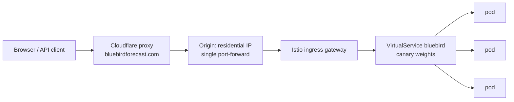

# Traffic: how requests reach Bluebird, and what Bluebird calls

[`CICD.md`](CICD.md) covers how code becomes a running deployment. This page
covers the running deployment's traffic: the path a request takes from a
browser to a pod, every external API the system talks to, and the rate
limiting that protects the shared free services underneath. It exists because
half of this configuration (Cloudflare, upstream usage policies) lives outside
this repo, and undocumented edge config is unreproducible edge config.

## Inbound: browser to pod

- **Cloudflare** proxies the zone (orange-cloud DNS). It terminates the public
  TLS session, hides the origin IP, and is where the coarse edge rate rule
  lives (below). It sets `CF-Connecting-IP` on every forwarded request, and
  overwrites any value the client sent.
- **The origin** is a single port-forward on a residential IP. Until
  [#148](https://github.com/zimmertr/bluebird/issues/148) moves ingress to a
  Cloudflare Tunnel, someone who discovers that IP can reach the cluster
  without passing Cloudflare, which is why the app never *trusts* Cloudflare
  to have filtered anything (see "Client identity" below).
- **Istio** routes `bluebirdforecast.com` through the `bluebird`
  VirtualService to the stable/canary services managed by Argo Rollouts
  (3 replicas stable; roughly double mid-rollout).

There is deliberately **no Envoy/Istio rate limiting layer**. Istio still has
no first-class rate-limit API; the mechanism is a raw `EnvoyFilter` wrapping
`envoy.filters.http.local_ratelimit`, which is per-pod (same imprecision as
the app's own limiter), can't key on client address without brittle descriptor
config, and is the most version-sensitive kind of YAML in the stack. Both jobs
it could do are already covered: Cloudflare rejects floods before they cross
the ocean, and the app enforces the precise per-client and per-upstream
limits. Decision recorded in
[#75](https://github.com/zimmertr/bluebird/issues/75).

## Edge rate rule (Cloudflare)

One zone rate-limiting rule backstops everything, at the only layer that sits
in front of the whole cluster:

| | |
| --- | --- |
| Match | `bluebirdforecast.com/api/*` |
| Threshold | 20 requests per 10 seconds per client IP |
| Action | Block for the mitigation window |

The rule is blunt on purpose: normal use (a page load, an analysis, a search)
is a handful of `/api` calls, so a client tripping it is hammering. The app's
own limits are the precise ones. This rule is configured in the Cloudflare
dashboard/API, not in git; if it changes, change this table in the same
breath.

> **Status:** pending. The rule will be applied once the Cloudflare API token
> gains its zone scopes; until then only the app-layer limits below enforce.

## App-layer limits

Two mechanisms in `backend/app/ratelimit.py`, both in-memory and per pod.
With R replicas the effective ceiling is about R times the configured number;
that slop is accepted (the goal is a bound, not precision), and the shared
datastore planned in [#65](https://github.com/zimmertr/bluebird/issues/65)
can make both exact later. All knobs are env vars, documented in the
[README's Configuration table](../README.md#configuration) and published to
clients by `GET /api/capabilities`.

**Per-client token buckets** on the expensive routes only. Over the limit:
`429` + `Retry-After`.

| Bucket | Routes | Default |
| --- | --- | --- |
| analyze | `POST /api/analyze`, `POST /api/analyze/stream` | 12/min, burst 6 |
| geocode | `GET /api/geocode` | 30/min, burst 10 |

**Pod-wide upstream budgets** capping what all concurrent requests may have
in flight against each provider. Saturation queues up to
`UPSTREAM_BUDGET_WAIT_S` (30s), then sheds: `503` + `Retry-After` (the SSE
stream reports it as an `error` event; best-effort AQI just degrades to
null). A `500` is never the answer to load.

### Client identity

Rate limiting keys on, in order: `CF-Connecting-IP` (Cloudflare overwrites
it, so proxied traffic can't rotate it), else the **rightmost**
`X-Forwarded-For` hop (each proxy appends to the right, so that's the peer
our edge actually saw; the leftmost hop is client-typed and rotating it must
not mint fresh buckets), else the socket peer. The access log prints the same
value enforcement counted.

Honest caveat: traffic that reaches the origin directly (bypassing
Cloudflare) can forge both headers until #148 closes that path. The upstream
budgets are the backstop a spoofer cannot bypass, because they don't care who
you claim to be.

## Outbound: what calls what

| Provider | Called by | From | Policy | Governor |
| --- | --- | --- | --- | --- |
| [Overpass API](https://wiki.openstreetmap.org/wiki/Overpass_API) | backend (`osm.py`), 1 query per analysis, 3-mirror failover | cluster egress IP | ~2 slots per IP (overpass-api.de) | `UPSTREAM_CONCURRENCY_OVERPASS=2` per pod, slot held across the whole failover chain |
| [Open-Meteo forecast](https://open-meteo.com) | backend (`weather.py`), ≤20 batches of 50 per analysis | cluster egress IP | ~10k calls/day/IP, non-commercial | `UPSTREAM_CONCURRENCY_WEATHER=8` per pod + per-analysis cap of 4 |
| [Open-Meteo air quality](https://open-meteo.com/en/docs/air-quality-api) | backend (`air_quality.py`), same batching, best-effort | cluster egress IP | same | `UPSTREAM_CONCURRENCY_AQI=8` per pod; exhaustion degrades to null |
| [Nominatim](https://operations.osmfoundation.org/policies/nominatim/) | backend (`geocode.py`) proxying the search box | cluster egress IP | absolute ~1 req/s per service, real User-Agent required | `NOMINATIM_MIN_INTERVAL_MS=2000` spacing per pod (~1/s aggregate at 3 replicas) + per-client geocode bucket |
| [NIFC WFIGS](https://data-nifc.opendata.arcgis.com) (wildfire overlay) | **browser**, per viewport | each visitor's own IP | public ArcGIS service | none needed; load scales with visitors, not with us |

The asymmetry in the last row is the point: everything the browser fetches
itself costs our egress IP nothing. A planned follow-up to
[#75](https://github.com/zimmertr/bluebird/issues/75) moves the Open-Meteo
fetches (40 of the ~41 upstream calls per analysis) into the browser the same
way, shrinking the server's upstream footprint to roughly one Overpass call
per analysis. Nominatim can never move client-side: its policy requires an
identifying `User-Agent`, which browsers refuse to set.

## Worst-case math

One analysis of 1,000 destinations (the `MAX_ANALYZE_PEAKS` cap) is 1
Overpass query + 20 weather batches + 20 AQI batches ≈ **41 upstream
calls**. The per-client bucket bounds one address to a burst of 6 analyses
and 12/minute sustained (per pod); the budgets bound the whole pod to 8+8+2
upstream calls in flight regardless of how many clients are asking. Multiply
by replicas for the cluster ceiling, and remember a canary rollout roughly
doubles pod count for its duration.
